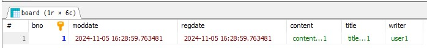
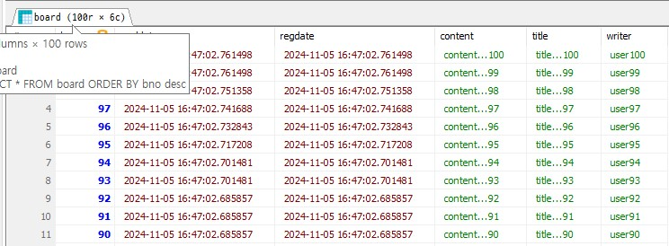

### 테스트코드를 통한 CRUD/페이징 처리 확인 438
new package: test/java/org.zerock.b01.repository
new java class : BoardRepositoryTests
test/java/org.zeroco.b01/repository/BoardRepositoryTests

- save: insert/update
- findById: select
- deleteById: delete

```java
package org.zerock.b01.repository;

import lombok.extern.log4j.Log4j2;
import org.springframework.beans.factory.annotation.Autowired;
import org.springframework.boot.test.context.SpringBootTest;

@SpringBootTest
@Log4j2
public class BoardRepositoryTests {
    
    @Autowired
    private BoardRepository boardRepository;
    
    
}
```

#### insert
BoardRepositoryTests
```java
@Test
    public void insertOne() {
        Board board = Board.builder()
                .title("title...1")
                .content("content...1")
                .writer("user1")
                .build();
        
        Board result = boardRepository.save(board);
        log.info("BNO: " + result.getBno());
    }
```
log
```
2024-11-05 16:28:57.206  INFO 10032 --- [    Test worker] org.hibernate.dialect.Dialect            : HHH000400: Using dialect: org.hibernate.dialect.MariaDB53Dialect
Hibernate: 
    
    create table board (
       bno bigint not null auto_increment,
        moddate datetime(6),
        regdate datetime(6),
        content varchar(2000) not null,
        title varchar(500) not null,
        writer varchar(50) not null,
        primary key (bno)
    ) engine=InnoDB
```
```
Hibernate: 
    insert 
    into
        board
        (moddate, regdate, content, title, writer) 
    values
        (?, ?, ?, ?, ?)
2024-11-05 16:28:59.841  INFO 10032 --- [    Test worker] o.z.b01.repository.BoardRepositoryTests  : BNO: 1
```

MariaDB
| Java data type | @ | MariaDB |
|-------------|--|--------|
| Long      |   | bigint |
| String    | @Column(length=500) | varchar(500) |
|LocalDateTime| | datetime(6) |
|             | nullable = false | not null |
|             | @Id | primary key (bno) |
|           |@GeneratedValue(strategy = GenerationType.IDENTITY)|auto_increment|
insertOne

insert



SELECT * FROM board ORDER BY bno desc;

#### select
BoardRepositoryTests
```java
    @Test
    public void select() {
        Long bno = 100L;
        Optional<Board> result = boardRepository.findById(bno);
        Board board = result.orElseThrow();
        log.info(board);
    }
```
log
```
Hibernate: 
    select
        board0_.bno as bno1_0_0_,
        board0_.moddate as moddate2_0_0_,
        board0_.regdate as regdate3_0_0_,
        board0_.content as content4_0_0_,
        board0_.title as title5_0_0_,
        board0_.writer as writer6_0_0_ 
    from
        board board0_ 
    where
        board0_.bno=?
```
#### update
BoardRepositoryTests 추가
Board 추가: 변경 메소드 추가
Board
```java
    public void change(String title, String content) {
        this.title = title;
        this.content = content;
    }
```
BoardRepositoryTests
1. findById: select
```shell
Hibernate: 
    select
        board0_.bno as bno1_0_0_,
        board0_.moddate as moddate2_0_0_,
        board0_.regdate as regdate3_0_0_,
        board0_.content as content4_0_0_,
        board0_.title as title5_0_0_,
        board0_.writer as writer6_0_0_ 
    from
        board board0_ 
    where
        board0_.bno=?
```
2. save: select
```shell
Hibernate: 
    select
        board0_.bno as bno1_0_0_,
        board0_.moddate as moddate2_0_0_,
        board0_.regdate as regdate3_0_0_,
        board0_.content as content4_0_0_,
        board0_.title as title5_0_0_,
        board0_.writer as writer6_0_0_ 
    from
        board board0_ 
    where
        board0_.bno=?
```
3. save: update
```shell
Hibernate: 
    update
        board 
    set
        moddate=?,
        content=?,
        title=?,
        writer=? 
    where
        bno=?
```

#### delete

```shell
Hibernate: 
    select
        board0_.bno as bno1_0_0_,
        board0_.moddate as moddate2_0_0_,
        board0_.regdate as regdate3_0_0_,
        board0_.content as content4_0_0_,
        board0_.title as title5_0_0_,
        board0_.writer as writer6_0_0_ 
    from
        board board0_ 
    where
        board0_.bno=?
Hibernate: 
    delete 
    from
        board 
    where
        bno=?
```

#### Pageable과 Page<E> 타입
org.springframework.data.domain.Pageable
페이지는 0부터

- findAll
  BoardRepositoryTests
```java
    @Test
    public void paging() {
        Pageable pageable = PageRequest.of(0, 10, Sort.by("bno").descending());
                                        // page, size, sort
        Page<Board> result = boardRepository.findAll(pageable);
    }
```
전체 데이터의 개수를 처리하는 쿼리가 같이 실행됨
```shell
Hibernate: 
    select
        board0_.bno as bno1_0_,
        board0_.moddate as moddate2_0_,
        board0_.regdate as regdate3_0_,
        board0_.content as content4_0_,
        board0_.title as title5_0_,
        board0_.writer as writer6_0_ 
    from
        board board0_ 
    order by
        board0_.bno desc limit ?
Hibernate: 
    select
        count(board0_.bno) as col_0_0_ 
    from
        board board0_
```

- page number = 0
- page size = 10
- total count = 100
- total pages : 100/10 = 10 size로 만들어진 페이지 개수 (total/size=pages)
```shell
2024-11-05 17:21:41.693  INFO 12148 --- [    Test worker] o.z.b01.repository.BoardRepositoryTests  : total count=100
2024-11-05 17:21:41.693  INFO 12148 --- [    Test worker] o.z.b01.repository.BoardRepositoryTests  : total pages=10
2024-11-05 17:21:41.693  INFO 12148 --- [    Test worker] o.z.b01.repository.BoardRepositoryTests  : page number=0
2024-11-05 17:21:41.693  INFO 12148 --- [    Test worker] o.z.b01.repository.BoardRepositoryTests  : page size = 10
2024-11-05 17:21:41.693  INFO 12148 --- [    Test worker] o.z.b01.repository.BoardRepositoryTests  : Board(bno=100, title=title changed 100, content=content changed 100, writer=user100)
2024-11-05 17:21:41.693  INFO 12148 --- [    Test worker] o.z.b01.repository.BoardRepositoryTests  : Board(bno=99, title=title...99, content=content...99, writer=user99)
2024-11-05 17:21:41.693  INFO 12148 --- [    Test worker] o.z.b01.repository.BoardRepositoryTests  : Board(bno=98, title=title...98, content=content...98, writer=user98)
2024-11-05 17:21:41.693  INFO 12148 --- [    Test worker] o.z.b01.repository.BoardRepositoryTests  : Board(bno=97, title=title...97, content=content...97, writer=user97)
2024-11-05 17:21:41.693  INFO 12148 --- [    Test worker] o.z.b01.repository.BoardRepositoryTests  : Board(bno=96, title=title...96, content=content...96, writer=user96)
2024-11-05 17:21:41.693  INFO 12148 --- [    Test worker] o.z.b01.repository.BoardRepositoryTests  : Board(bno=95, title=title...95, content=content...95, writer=user95)
2024-11-05 17:21:41.693  INFO 12148 --- [    Test worker] o.z.b01.repository.BoardRepositoryTests  : Board(bno=94, title=title...94, content=content...94, writer=user94)
2024-11-05 17:21:41.693  INFO 12148 --- [    Test worker] o.z.b01.repository.BoardRepositoryTests  : Board(bno=93, title=title...93, content=content...93, writer=user93)
2024-11-05 17:21:41.693  INFO 12148 --- [    Test worker] o.z.b01.repository.BoardRepositoryTests  : Board(bno=92, title=title...92, content=content...92, writer=user92)
2024-11-05 17:21:41.693  INFO 12148 --- [    Test worker] o.z.b01.repository.BoardRepositoryTests  : Board(bno=91, title=title...91, content=content...91, writer=user91)
```
