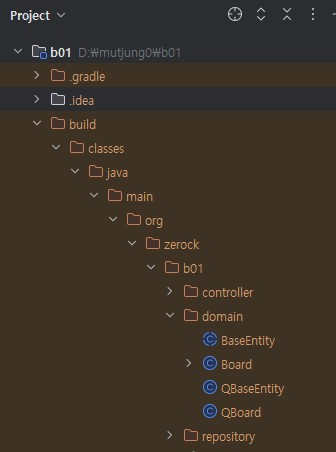

## QueryDSL을 이용한 동적 쿼리 처리 447
### Querydsl을 사용하기 위한 프로젝트 설정 변경
build.gradle
#### buildscript
```groovy
buildscript {
	ext {
		queryDslVersion = "5.0.0"
	}
}
```
#### dependencies
java 11
```groovy
dependencies {
    implementation 'com.querydsl:querydsl-jpa:${queryDslVersion}'
    annotationProcessor 'com.querydsl:querydsl-apt:${queryDslVersion}:jpa'
    annotationProcessor 'javax.annotation:javax.annotation-api'
    annotationProcessor 'javax.persistence:javax.persistence-api'
}
```
java 17
```groovy
dependencies {
    implementation 'com.querydsl:querydsl-jpa:5.0.0:jakarta'
    annotationProcessor 'com.querydsl:querydsl-apt:5.0.0:jakarta'
    annotationProcessor 'jakarta.annotation:jakarta.annotation-api'
    annotationProcessor 'jakarta.persistence:jakarta.persistence-api'
}
```
#### buildscript
```groovy
sourceSets {
	main {
		java {
			srcDirs = ["$projectDir/src/main/java", "$projectDir/build/generated"]
		}
	}
}
```

#### Querydsl 설정확인 449

Gradle>Tasks>other>compieJava 실행
build 폴더에 QBoard 클래스가 생성된 것을 볼수 있다

### 기존의 Repository와 Querydsl 연동 449
1. Querydsl을 이용할 인터페이스 선언
2. 인터페이스이름+Impl 이름으로 클래스 선언 - 이때 QuerydslRepositorySupport 라는 부모클래스 지정
3. 기존의 repository에는 부모 인터페이스로 Querydsl을 위한 인터페이스를 지정

repository/search/BoardSearch interface new
repository/search/BoardSearchImpl class new


repository/BoardRepository edit
```java
package org.zerock.b01.repository;

import org.springframework.data.jpa.repository.JpaRepository;
import org.springframework.data.jpa.repository.Query;
import org.zerock.b01.domain.Board;
import org.zerock.b01.repository.search.BoardSearch;

public interface BoardRepository extends JpaRepository<Board, Long>, BoardSearch {

    @Query(value = "select now()", nativeQuery = true)
    String getTime();
}
```
#### Q도메인을 이용한 쿼리 작성 및 테스트 451
repository/search/BoardSearchImpl class edit
```java
package org.zerock.b01.repository.search;

import com.querydsl.jpa.JPQLQuery;
import org.springframework.data.domain.Page;
import org.springframework.data.domain.Pageable;
import org.springframework.data.jpa.repository.support.QuerydslRepositorySupport;
import org.zerock.b01.domain.Board;
import org.zerock.b01.domain.QBoard;

import java.util.List;

public class BoardSearchImpl extends QuerydslRepositorySupport implements BoardSearch {

    public BoardSearchImpl() {
        super(Board.class);
    }

    @Override
    public Page<Board> search1(Pageable pageable) {
        QBoard board = QBoard.board; // q도메인 객체
        JPQLQuery<Board> query = from(board); // select.. from board
        query.where(board.title.contains("1")); // where title like ...
        List<Board> list = query.fetch();
        long count = query.fetchCount();
        return null;
    }
}
```
BoardRepositoryTests
```java
    @Test
    public void search1() {
        // 1 = 2번째 page
        Pageable pageable = PageRequest.of(1, 10, Sort.by("bno").descending());
        boardRepository.search1(pageable);
    }
```
error: Attempt to recreate a file for type org.zerock.b01.domain.QBaseEntity
Settings>Build Tools>Gradle>Gradle Projects: Build&Run using, test: Intellj
```shell
Hibernate: 
    select
        board0_.bno as bno1_0_,
        board0_.moddate as moddate2_0_,
        board0_.regdate as regdate3_0_,
        board0_.content as content4_0_,
        board0_.title as title5_0_,
        board0_.writer as writer6_0_ 
    from
        board board0_ 
    where
        board0_.title like ? escape '!'
Hibernate: 
    select
        count(board0_.bno) as col_0_0_ 
    from
        board board0_ 
    where
        board0_.title like ? escape '!'
```

#### Querydsl로 Pageable 처리 453
repository/search/BoardSearchImpl class edit
```java
        query.where(board.title.contains("1"));  
        // paging
        this.getQuerydsl().applyPagination(pageable, query);
```
BoardRepositoryTests.search1 실행 - limit 적용됨
```shell
Hibernate: 
    select
        board0_.bno as bno1_0_,
        board0_.moddate as moddate2_0_,
        board0_.regdate as regdate3_0_,
        board0_.content as content4_0_,
        board0_.title as title5_0_,
        board0_.writer as writer6_0_ 
    from
        board board0_ 
    where
        board0_.title like ? escape '!' 
    order by
        board0_.bno desc limit ?,
        ?
Hibernate: 
    select
        count(board0_.bno) as col_0_0_ 
    from
        board board0_ 
    where
        board0_.title like ? escape '!'
```

### Querydsl로 검색 조건과 목록 처리 454
#### BooleanBuilder
제목이나 내용에 특정한 키워드가 존재하고 bno가 0보다 큰 데이터
```shell
SELECT * FROM board 
WHERE 
(
	title LIKE CONCAT('%', '1', '%')
	OR content LIKE CONCAT('%', '1', '%')
)
ORDER BY bno DESC;
```

querydsl을 이용할때()가 필요한 상황이면 BooleanBuilder를 이용해서 작성할수있다
```shell
        JPQLQuery<Board> query = from(board); // select.. from board

        BooleanBuilder builder = new BooleanBuilder(); // (
        builder.or(board.title.contains("11")); // title like ...
        builder.or(board.content.contains("11")); // content like..
        query.where(builder);
        query.where(board.bno.gt(0L));
```

log
```shell
Hibernate: 
    select
        board0_.bno as bno1_0_,
        board0_.moddate as moddate2_0_,
        board0_.regdate as regdate3_0_,
        board0_.content as content4_0_,
        board0_.title as title5_0_,
        board0_.writer as writer6_0_ 
    from
        board board0_ 
    where
        (
            board0_.title like ? escape '!' 
            or board0_.content like ? escape '!'
        ) 
        and board0_.bno>? 
    order by
        board0_.bno desc limit ?,
        ?
Hibernate: 
    select
        count(board0_.bno) as col_0_0_ 
    from
        board board0_ 
    where
        (
            board0_.title like ? escape '!' 
            or board0_.content like ? escape '!'
        ) 
        and board0_.bno>?
```

#### 검색을 위한 메소드 선언과 테스트 455
BoardSearch edit + searchAll
```java
public interface BoardSearch {
    Page<Board> search1(Pageable pageable);
    Page<Board> seachAll(String[] types, String keyword, Pageable pageable);
}
```

```shell
Hibernate: 
    select
        board0_.bno as bno1_0_,
        board0_.moddate as moddate2_0_,
        board0_.regdate as regdate3_0_,
        board0_.content as content4_0_,
        board0_.title as title5_0_,
        board0_.writer as writer6_0_ 
    from
        board board0_ 
    where
        (
            board0_.title like ? escape '!' 
            or board0_.content like ? escape '!' 
            or board0_.writer like ? escape '!'
        ) 
        and board0_.bno>? 
    order by
        board0_.bno desc limit ?
Hibernate: 
    select
        count(board0_.bno) as col_0_0_ 
    from
        board board0_ 
    where
        (
            board0_.title like ? escape '!' 
            or board0_.content like ? escape '!' 
            or board0_.writer like ? escape '!'
        ) 
        and board0_.bno>?
```

#### PageImpl을 이용한 Page<T> 반환
Page<T> 타입을 반환하는 것이 querydsl에서는 직접 처리해야하는 불편함이 있다.
- Spring Data JPA에서는 PageImpl이라는 클래스를 제공해서 3개의 파라미터로 page<T>를 생성할수잇따.
  - List<T> : 실제목록데이터
  - Pageable : 페이지관련정보를 가진객체
  - long : 전체개수

BoardSearchImpl.searchAll
```java
        // paging
        this.getQuerydsl().applyPagination(pageable, query);
        List<Board> list = query.fetch();
        long count = query.fetchCount();
        return new PageImpl<>(list, pageable, count);
```

```shell
Hibernate: 
    select
        board0_.bno as bno1_0_,
        board0_.moddate as moddate2_0_,
        board0_.regdate as regdate3_0_,
        board0_.content as content4_0_,
        board0_.title as title5_0_,
        board0_.writer as writer6_0_ 
    from
        board board0_ 
    where
        (
            board0_.title like ? escape '!' 
            or board0_.content like ? escape '!' 
            or board0_.writer like ? escape '!'
        ) 
        and board0_.bno>? 
    order by
        board0_.bno desc limit ?
Hibernate: 
    select
        count(board0_.bno) as col_0_0_ 
    from
        board board0_ 
    where
        (
            board0_.title like ? escape '!' 
            or board0_.content like ? escape '!' 
            or board0_.writer like ? escape '!'
        ) 
        and board0_.bno>?
```


log
```shell
2024-11-06 11:09:42.590  INFO 12236 --- [           main] o.z.b01.repository.BoardRepositoryTests  : getTotalPages=2
2024-11-06 11:09:42.590  INFO 12236 --- [           main] o.z.b01.repository.BoardRepositoryTests  : getSize=10
2024-11-06 11:09:42.590  INFO 12236 --- [           main] o.z.b01.repository.BoardRepositoryTests  : getNumber=0
2024-11-06 11:09:42.590  INFO 12236 --- [           main] o.z.b01.repository.BoardRepositoryTests  : hasPrevious=false
2024-11-06 11:09:42.590  INFO 12236 --- [           main] o.z.b01.repository.BoardRepositoryTests  : hasNext=true
2024-11-06 11:09:42.590  INFO 12236 --- [           main] o.z.b01.repository.BoardRepositoryTests  : Board(bno=100, title=title changed 100, content=content changed 100, writer=user100)
2024-11-06 11:09:42.590  INFO 12236 --- [           main] o.z.b01.repository.BoardRepositoryTests  : Board(bno=91, title=title...91, content=content...91, writer=user91)
2024-11-06 11:09:42.590  INFO 12236 --- [           main] o.z.b01.repository.BoardRepositoryTests  : Board(bno=81, title=title...81, content=content...81, writer=user81)
2024-11-06 11:09:42.590  INFO 12236 --- [           main] o.z.b01.repository.BoardRepositoryTests  : Board(bno=71, title=title...71, content=content...71, writer=user71)
2024-11-06 11:09:42.590  INFO 12236 --- [           main] o.z.b01.repository.BoardRepositoryTests  : Board(bno=61, title=title...61, content=content...61, writer=user61)
2024-11-06 11:09:42.590  INFO 12236 --- [           main] o.z.b01.repository.BoardRepositoryTests  : Board(bno=51, title=title...51, content=content...51, writer=user51)
2024-11-06 11:09:42.590  INFO 12236 --- [           main] o.z.b01.repository.BoardRepositoryTests  : Board(bno=41, title=title...41, content=content...41, writer=user41)
2024-11-06 11:09:42.590  INFO 12236 --- [           main] o.z.b01.repository.BoardRepositoryTests  : Board(bno=31, title=title...31, content=content...31, writer=user31)
2024-11-06 11:09:42.590  INFO 12236 --- [           main] o.z.b01.repository.BoardRepositoryTests  : Board(bno=21, title=title...21, content=content...21, writer=user21)
2024-11-06 11:09:42.590  INFO 12236 --- [           main] o.z.b01.repository.BoardRepositoryTests  : Board(bno=19, title=title...19, content=content...19, writer=user19)
```
getTotalElements 20 전체갯수
getTotalPages 2 전체페이지
getSize 10 페이지사이즈
getNumber 0 현재페이지
