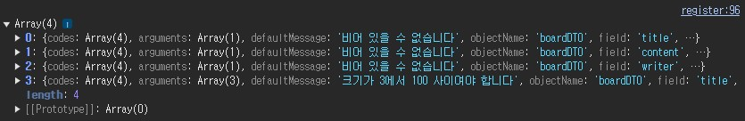
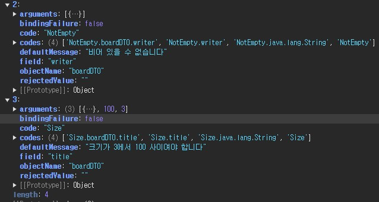

HV000030: No validator could be found for constraint 'javax.validation.constraints.Size' validating type 'java.lang.Long'. Check configuration for 'bno'
javax.validation.UnexpectedTypeException: HV000030: No validator could be found for constraint 'javax.validation.constraints.Size' validating type 'java.lang.Long'. Check configuration for 'bno'

@NotEmpty <- 문제
private Long bno;

삭제
private Long bno;

field = title, code=NotEmpty  비어 있을 수 없습니다
field = content, code=NotEmpty
field = writer, code=NotEmpty
field = title, code=Size 크기가 3에서 100 사이여야 합니다

console log


```shell
[
{
"codes": [
"NotEmpty.boardDTO.title",
"NotEmpty.title",
"NotEmpty.java.lang.String",
"NotEmpty"
],
"arguments": [
{
"codes": [
"boardDTO.title",
"title"
],
"arguments": null,
"defaultMessage": "title",
"code": "title"
}
],
"defaultMessage": "비어 있을 수 없습니다",
"objectName": "boardDTO",
"field": "title",
"rejectedValue": "",
"bindingFailure": false,
"code": "NotEmpty"
},
{
"codes": [
"NotEmpty.boardDTO.content",
"NotEmpty.content",
"NotEmpty.java.lang.String",
"NotEmpty"
],
"arguments": [
{
"codes": [
"boardDTO.content",
"content"
],
"arguments": null,
"defaultMessage": "content",
"code": "content"
}
],
"defaultMessage": "비어 있을 수 없습니다",
"objectName": "boardDTO",
"field": "content",
"rejectedValue": "",
"bindingFailure": false,
"code": "NotEmpty"
},
{
"codes": [
"NotEmpty.boardDTO.writer",
"NotEmpty.writer",
"NotEmpty.java.lang.String",
"NotEmpty"
],
"arguments": [
{
"codes": [
"boardDTO.writer",
"writer"
],
"arguments": null,
"defaultMessage": "writer",
"code": "writer"
}
],
"defaultMessage": "비어 있을 수 없습니다",
"objectName": "boardDTO",
"field": "writer",
"rejectedValue": "",
"bindingFailure": false,
"code": "NotEmpty"
},
{
"codes": [
"Size.boardDTO.title",
"Size.title",
"Size.java.lang.String",
"Size"
],
"arguments": [
{
"codes": [
"boardDTO.title",
"title"
],
"arguments": null,
"defaultMessage": "title",
"code": "title"
},
100,
3
],
"defaultMessage": "크기가 3에서 100 사이여야 합니다",
"objectName": "boardDTO",
"field": "title",
"rejectedValue": "",
"bindingFailure": false,
"code": "Size"
}
]
```


