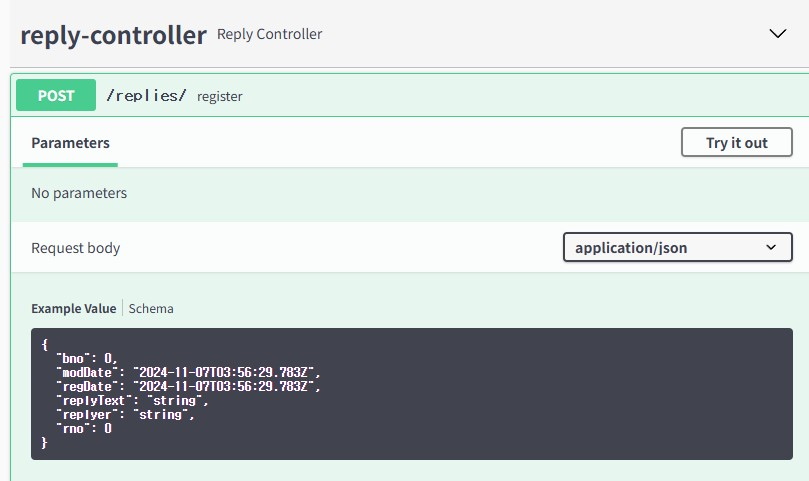
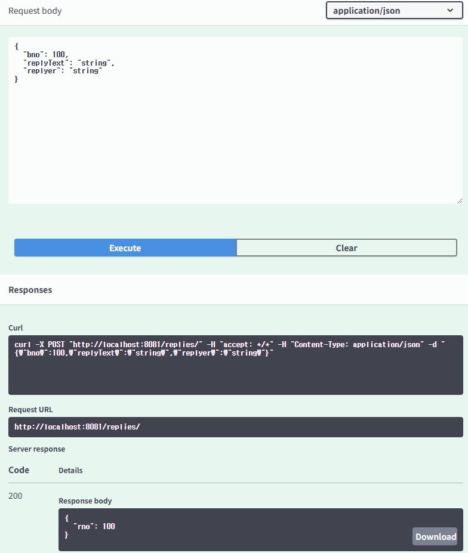
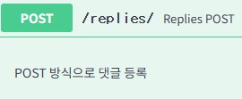

{
"bno": 100,
"modDate": "2024-11-07T03:58:56.336Z",
"regDate": "2024-11-07T03:58:56.336Z",
"replyText": "string",
"replyer": "string",
"rno": 0
}



- log
```shell
o.zerock.b01.controller.ReplyController  : ReplyDTO(rno=null, bno=100, replyText=string, replyer=string, regDate=null, modDate=null)
```

```java
@ApiOperation(value = "Replies POST", notes = "POST 방식으로 댓글 등록")
```


request
{
}


response
{
"replyText": "NotEmpty",
"bno": "NotNull",
"replyer": "NotEmpty"
}

log
```shell
Field error in object 'replyDTO' on field 'replyText': rejected value [null]; codes [NotEmpty.replyDTO.replyText,NotEmpty.replyText,NotEmpty.java.lang.String,NotEmpty]; arguments [org.springframework.context.support.DefaultMessageSourceResolvable: codes [replyDTO.replyText,replyText]; arguments []; default message [replyText]]; default message [비어 있을 수 없습니다]
Field error in object 'replyDTO' on field 'replyer': rejected value [null]; codes [NotEmpty.replyDTO.replyer,NotEmpty.replyer,NotEmpty.java.lang.String,NotEmpty]; arguments [org.springframework.context.support.DefaultMessageSourceResolvable: codes [replyDTO.replyer,replyer]; arguments []; default message [replyer]]; default message [비어 있을 수 없습니다]
Field error in object 'replyDTO' on field 'bno': rejected value [null]; codes [NotNull.replyDTO.bno,NotNull.bno,NotNull.java.lang.Long,NotNull]; arguments [org.springframework.context.support.DefaultMessageSourceResolvable: codes [replyDTO.bno,bno]; arguments []; default message [bno]]; default message [널이어서는 안됩니다]
```

domain.Reply new
```shell
Hibernate: 
    create table reply (
       rno bigint not null auto_increment,
        moddate datetime(6),
        regdate datetime(6),
        reply_text varchar(255),
        replyer varchar(255),
        board_bno bigint,
        primary key (rno)
    ) engine=InnoDB
Hibernate: 
    alter table reply 
       add constraint FKr1bmblqir7dalmh47ngwo7mcs 
       foreign key (board_bno) 
       references board (bno)
```

```shell
Hibernate: 
    insert 
    into
        reply
        (moddate, regdate, board_bno, reply_text, replyer) 
    values
        (?, ?, ?, ?, ?)
```

#### 특정 게시물의 댓글 조회화 인덱스 537
@Table 어노테이션에 추가적인 설정을 이용해서 인덱스를 지정할 수 있음
[Reply.java](..%2Fsrc%2Fmain%2Fjava%2Forg%2Fzerock%2Fb01%2Fdomain%2FReply.java)
```java
import javax.persistence.*;

@Entity
@Table(name = "Reply", indexes = {@Index(name = "idx_reply_board_bno", columnList = "board_bno")})
```
특정한 게시글의 댓글들은 페이징 처리할수 있도록 Pageable 기능을 ReplyRepository에 @Query를 이용해서 작성

```shell
Hibernate: 
    select
        reply0_.rno as rno1_1_,
        reply0_.moddate as moddate2_1_,
        reply0_.regdate as regdate3_1_,
        reply0_.board_bno as board_bn6_1_,
        reply0_.reply_text as reply_te4_1_,
        reply0_.replyer as replyer5_1_ 
    from
        reply reply0_ 
    where
        reply0_.board_bno=? 
    order by
        reply0_.rno desc limit ?
2024-11-07 14:58:40.060  INFO 4520 --- [           main] o.z.b01.repository.ReplyRepositoryTests  : Reply(rno=1, replyText=댓글.., replyer=replyer1)
```

```java
@ManyToOne(fetch = FetchType.LAZY)
private Board board;
```
- LAZY: 지연로딩. 기본적으로 필요한 순간까지 데이터베이스와 연결하지 않는 방식
- EAGER: LAZY 반대. 즉시로딩. 해당 엔티티를 로딩할때 같이 로딩하는 방식
  - EAGER는 성능에 영향을 줄수있으므로 LAZY를 기본으로 사용하고 필요에 따라서 EAGER을 고려

Left outer join 글에 댓글 없는 경우

```shell
Hibernate: 
    select
        board0_.bno as col_0_0_,
        board0_.title as col_1_0_,
        board0_.writer as col_2_0_,
        board0_.regdate as col_3_0_,
        count(reply1_.rno) as col_4_0_ 
    from
        board board0_ 
    left outer join
        reply reply1_ 
            on (
                reply1_.board_bno=board0_.bno
            ) 
    where
        (
            board0_.title like ? escape '!' 
            or board0_.content like ? escape '!' 
            or board0_.writer like ? escape '!'
        ) 
        and board0_.bno>? 
    group by
        board0_.bno 
    order by
        board0_.bno desc limit ?
Hibernate: 
    select
        count(distinct board0_.bno) as col_0_0_ 
    from
        board board0_ 
    left outer join
        reply reply1_ 
            on (
                reply1_.board_bno=board0_.bno
            ) 
    where
        (
            board0_.title like ? escape '!' 
            or board0_.content like ? escape '!' 
            or board0_.writer like ? escape '!'
        ) 
        and board0_.bno>?
2024-11-07 15:25:07.571  INFO 9676 --- [           main] o.z.b01.repository.BoardRepositoryTests  : 3
2024-11-07 15:25:07.571  INFO 9676 --- [           main] o.z.b01.repository.BoardRepositoryTests  : 10
2024-11-07 15:25:07.571  INFO 9676 --- [           main] o.z.b01.repository.BoardRepositoryTests  : 0
2024-11-07 15:25:07.571  INFO 9676 --- [           main] o.z.b01.repository.BoardRepositoryTests  : false: true
2024-11-07 15:25:07.586  INFO 9676 --- [           main] o.z.b01.repository.BoardRepositoryTests  : BoardListReplyCountDTO(bno=101, title=Updated....101, writer=user00, regDate=2024-11-06T12:01:23.805313, replyCount=0)
2024-11-07 15:25:07.586  INFO 9676 --- [           main] o.z.b01.repository.BoardRepositoryTests  : BoardListReplyCountDTO(bno=100, title=title changed 100, writer=user100, regDate=2024-11-05T16:47:02.761498, replyCount=1)
2024-11-07 15:25:07.586  INFO 9676 --- [           main] o.z.b01.repository.BoardRepositoryTests  : BoardListReplyCountDTO(bno=91, title=title...91, writer=user91, regDate=2024-11-05T16:47:02.685857, replyCount=0)
2024-11-07 15:25:07.586  INFO 9676 --- [           main] o.z.b01.repository.BoardRepositoryTests  : BoardListReplyCountDTO(bno=81, title=title...81, writer=user81, regDate=2024-11-05T16:47:02.629660, replyCount=0)
2024-11-07 15:25:07.586  INFO 9676 --- [           main] o.z.b01.repository.BoardRepositoryTests  : BoardListReplyCountDTO(bno=71, title=title...71, writer=user71, regDate=2024-11-05T16:47:02.575128, replyCount=0)
2024-11-07 15:25:07.586  INFO 9676 --- [           main] o.z.b01.repository.BoardRepositoryTests  : BoardListReplyCountDTO(bno=61, title=title...61, writer=user61, regDate=2024-11-05T16:47:02.511326, replyCount=0)
2024-11-07 15:25:07.586  INFO 9676 --- [           main] o.z.b01.repository.BoardRepositoryTests  : BoardListReplyCountDTO(bno=51, title=title...51, writer=user51, regDate=2024-11-05T16:47:02.444768, replyCount=0)
2024-11-07 15:25:07.586  INFO 9676 --- [           main] o.z.b01.repository.BoardRepositoryTests  : BoardListReplyCountDTO(bno=41, title=title...41, writer=user41, regDate=2024-11-05T16:47:02.374609, replyCount=0)
2024-11-07 15:25:07.586  INFO 9676 --- [           main] o.z.b01.repository.BoardRepositoryTests  : BoardListReplyCountDTO(bno=31, title=title...31, writer=user31, regDate=2024-11-05T16:47:02.303405, replyCount=0)
2024-11-07 15:25:07.586  INFO 9676 --- [           main] o.z.b01.repository.BoardRepositoryTests  : BoardListReplyCountDTO(bno=21, title=title...21, writer=user21, regDate=2024-11-05T16:47:02.252497, replyCount=0)
```

ReplyServiceTests.register
```shell
Hibernate: 
    insert 
    into
        reply
        (moddate, regdate, board_bno, reply_text, replyer) 
    values
        (?, ?, ?, ?, ?)
2024-11-07 15:36:53.869  INFO 4840 --- [           main] o.zerock.b01.service.ReplyServiceTests   : 2
```

Swagger Request body
```json
{
  "bno": 100,
  "replyText": "string",
  "replyer": "string"
}
```
Response body
```json
{
  "rno": 3
}
```
없는 게시판 번호로 댓글 입력
Request
```json
{
"bno": 200,
"replyText": "한글 처리",
"replyer": "replyer"
}
```
Response 500
```json
{
"timestamp": 1730962125117,
"status": 500,
"error": "Internal Server Error",
"trace": "org.springframework.dao.DataIntegrityViolationException: could not execute statement; SQL [n/a]; constraint [null]; nested exception is
``` 

Response 400
```json
{
  "msg": "constraint fails",
  "time": "1730962224168"
}
```

### 특정 게시물의 댓글 목록 560


Parameters: bno=100


Response
```json
{
  "page": 1,
  "size": 10,
  "total": 4,
  "start": 1,
  "end": 1,
  "prev": false,
  "next": false,
  "dtoList": [
    {
      "rno": 1,
      "bno": 100,
      "replyText": "댓글..",
      "replyer": "replyer1",
      "regDate": [
        2024,
        11,
        7,
        14,
        49,
        13,
        926376000
      ],
      "modDate": [
        2024,
        11,
        7,
        14,
        49,
        13,
        926376000
      ]
    },
    {
      "rno": 2,
      "bno": 100,
      "replyText": "ReplyDTO Text",
      "replyer": "replyer",
      "regDate": [
        2024,
        11,
        7,
        15,
        36,
        53,
        823033000
      ],
      "modDate": [
        2024,
        11,
        7,
        15,
        36,
        53,
        823033000
      ]
    },
    {
      "rno": 3,
      "bno": 100,
      "replyText": "string",
      "replyer": "string",
      "regDate": [
        2024,
        11,
        7,
        15,
        44,
        55,
        877523000
      ],
      "modDate": [
        2024,
        11,
        7,
        15,
        44,
        55,
        877523000
      ]
    },
    {
      "rno": 4,
      "bno": 100,
      "replyText": "한글 처리",
      "replyer": "replyer",
      "regDate": [
        2024,
        11,
        7,
        15,
        46,
        30,
        789307000
      ],
      "modDate": [
        2024,
        11,
        7,
        15,
        46,
        30,
        789307000
      ]
    }
  ]
}
```

