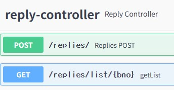
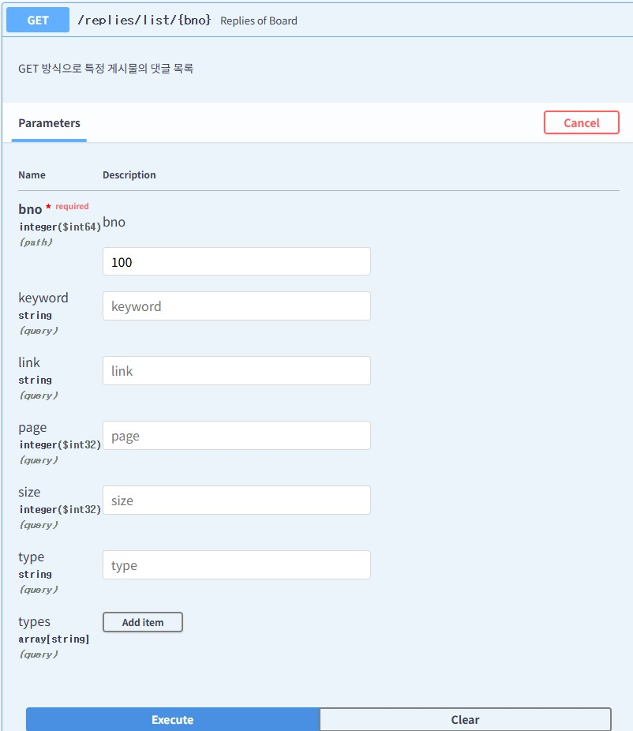

### 특정 게시물의 댓글 목록 560


- Parameters: bno=100



Response
```json
{
  "page": 1,
  "size": 10,
  "total": 4,
  "start": 1,
  "end": 1,
  "prev": false,
  "next": false,
  "dtoList": [
    {
      "rno": 1,
      "bno": 100,
      "replyText": "댓글..",
      "replyer": "replyer1",
      "regDate": [
        2024,
        11,
        7,
        14,
        49,
        13,
        926376000
      ],
      "modDate": [
        2024,
        11,
        7,
        14,
        49,
        13,
        926376000
      ]
    },
    {
      "rno": 2,
      "bno": 100,
      "replyText": "ReplyDTO Text",
      "replyer": "replyer",
      "regDate": [
        2024,
        11,
        7,
        15,
        36,
        53,
        823033000
      ],
      "modDate": [
        2024,
        11,
        7,
        15,
        36,
        53,
        823033000
      ]
    },
    {
      "rno": 3,
      "bno": 100,
      "replyText": "string",
      "replyer": "string",
      "regDate": [
        2024,
        11,
        7,
        15,
        44,
        55,
        877523000
      ],
      "modDate": [
        2024,
        11,
        7,
        15,
        44,
        55,
        877523000
      ]
    },
    {
      "rno": 4,
      "bno": 100,
      "replyText": "한글 처리",
      "replyer": "replyer",
      "regDate": [
        2024,
        11,
        7,
        15,
        46,
        30,
        789307000
      ],
      "modDate": [
        2024,
        11,
        7,
        15,
        46,
        30,
        789307000
      ]
    }
  ]
}
```

