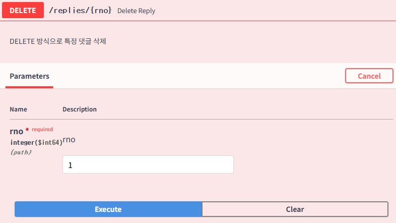
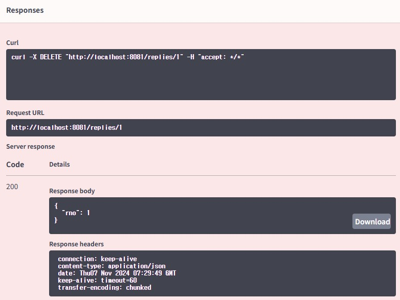

### 특정 댓글 삭제
[ReplyController.java](..%2Fsrc%2Fmain%2Fjava%2Forg%2Fzerock%2Fb01%2Fcontroller%2FReplyController.java)

에 remove 메소드 추가
- 
- Request URL: http://localhost:8081/replies/1
- Response body
```json
{
  "rno": 1
}
```



#### 존재하지 않는 번호의 삭제 예외 564
```json
{
  "timestamp": 1730964765777,
  "status": 500,
  "error": "Internal Server Error",
  "trace": "org.springframework.dao.EmptyResultDataAccessException: No class org.zerock.b01.domain.Reply entity with id 100 exists!\r\n\tat org.springframework.data.jpa.repository.support.SimpleJpaRepository.lambda$deleteById$0(SimpleJpaRepository.java:173)\r\n\tat java.base/java.util.Optional.orElseThrow(Optional.java:408)\r\n\tat org.springframework.data.jpa.repository.support.SimpleJpaRepository.deleteById(SimpleJpaRepository.java:172)\r\n\tat 
```
EmptyResultDataAccessException 발생
[CustomRestAdvice.java](..%2Fsrc%2Fmain%2Fjava%2Forg%2Fzerock%2Fb01%2Fcontroller%2Fadvice%2FCustomRestAdvice.java) 추가
```java
@ExceptionHandler({NoSuchElementException.class, EmptyResultDataAccessException.class})
```
추가후
- Response body
```json
{
"msg": "No Such Element Exception",
"time": "1730964873046"
}
```