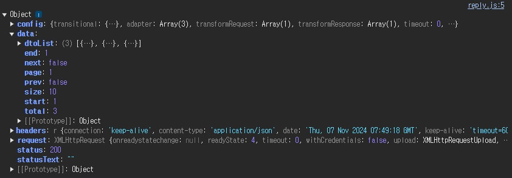
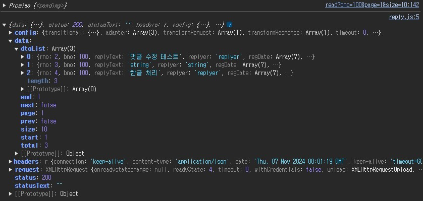

# 6.3 댓글의 자바스크립트 처리 567
## 비동기 처리와 Axios
## Axios를 위한 준비
댓글 처리가 필요한 화면에 Axios 라이브러리를 추가

resources/static/js/reply.js

read.html의 <div layout:fragment="content"> 가 끝나기 전에 Axios 라이브러리를 추가
reply.js도 추가

- read.html
```html
    <script src="https://cdn.jsdelivr.net/npm/axios/dist/axios.min.js"></script>
	<script src="/js/reply.js"></script>
</div><!--layout-->
```

### Axios 호출해보기 571
data


#### 비동기함수의 반환 573


#### 비동기 처리 방식의 결정 575
