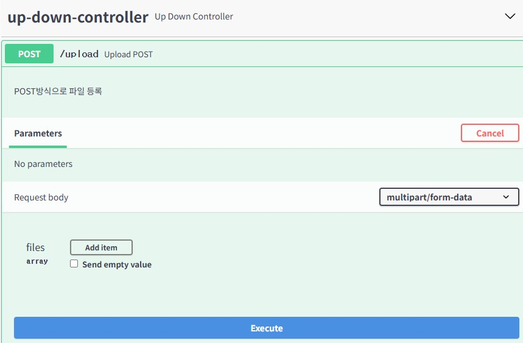

# 7. 파일 업로드 처리
## 7.1 첨부파일과 @OneToMany
### 파일 업로드를 위한 설정
서블릿 3 이상부터는 서블릿 API 자체에 파일 업로드 API를 제공하므로 추가적인 라이브러리가 필요하지 않음

#### 예제 프로젝트 구성 596
[application.properties](..%2Fsrc%2Fmain%2Fresources%2Fapplication.properties)

```
spring.servlet.multipart.enable=true
spring.servlet.multipart.location=D:\\upload
spring.servlet.multipart.max-request-size=30MB
spring.servlet.multipart.max-file-size=10MB
org.zerock.upload.path=D:\\upload
```

D:\\upload 폴더 생성

### 업로드 처리를 위한 DTO 598
파일 업로드는 MultipartFile이라는 API를 이용해서 처리함
이떄문에 컨트롤ㄹ러에서 파라미터를 MultipartFile로 지정해주면 간단한 파일 업로드처리는 가능하지만
Swagger UI같은 프레임워크로 테스트하기 불편하기 때문에
dto 패키지에 별로의 DTO로 선언해서 사용하는 것이 좋음

[UploadFileDTO.java](..%2Fsrc%2Fmain%2Fjava%2Forg%2Fzerock%2Fb01%2Fdto%2Fupload%2FUploadFileDTO.java)

### 컨트롤러와 Swagger UI 테스트
[UpDownController.java](..%2Fsrc%2Fmain%2Fjava%2Forg%2Fzerock%2Fb01%2Fcontroller%2FUpDownController.java)

- 프로젝트 재실행
- Swagger 확인 http://localhost:8081/swagger-ui/index.html


application.properties의설정정보를 @Value를 이용해서 처리
[UpDownController.java](..%2Fsrc%2Fmain%2Fjava%2Forg%2Fzerock%2Fb01%2Fcontroller%2FUpDownController.java)


```shell
2024-11-11 10:16:30.576  INFO 76 --- [nio-8081-exec-8] o.z.b01.controller.UpDownController      : UploadFileDTO(files=[org.springframework.web.multipart.support.StandardMultipartHttpServletRequest$StandardMultipartFile@6fc2e6c0, org.springframework.web.multipart.support.StandardMultipartHttpServletRequest$StandardMultipartFile@1ddff090])
2024-11-11 10:16:30.576  INFO 76 --- [nio-8081-exec-8] o.z.b01.controller.UpDownController      : Banner_Z3IxRAF24102914431872.jpg
2024-11-11 10:16:30.576  INFO 76 --- [nio-8081-exec-8] o.z.b01.controller.UpDownController      : Banner_0dzeQOU24102910124747.jpg
```

#### 첨부파일 저장
같은 이름의 파일이 문제되므로 java.util.UUID를 이용해서 새로운 값을 만들어냄
UUID는 중복될 가능성이 거의 없는 코드값을 생성한다
- UUID (16자리) + _ + 원래 파일명
  c29bf027-646f-4e4c-b275-6ac34f26eaeb

#### Thumbnail 파일처리
Thumbnailator 라이브러리 이용
```groovy
implementation 'net.coobird:thumbnailator:0.4.16'
```

파일이 이미지 파일이라면 섬네일을 생성하도록
100KB > 7KB


#### 업로드 결과의 반환처리
[UploadResultDTO.java](..%2Fsrc%2Fmain%2Fjava%2Forg%2Fzerock%2Fb01%2Fdto%2Fupload%2FUploadResultDTO.java)
```json
[
  {
    "uuid": "055e83a2-56b6-4330-a3a1-2d3e6d0af2e1",
    "fileName": "ㄱ`~!@#$%^&()=+[]{};',.jpg",
    "img": true,
    "link": "s_055e83a2-56b6-4330-a3a1-2d3e6d0af2e1_ㄱ`~!@#$%^&()=+[]{};',.jpg"
  }
]
```

getLink()대신에 link라는 속성이 생김

### 첨부파일조회
/view/파일이름

### 첨부파일삭제
```json
{
"result": true
}
```
