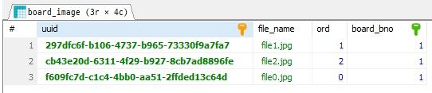
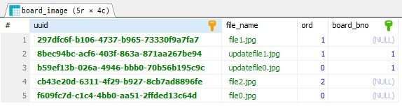

## 7.2 @OneToMany 611
@ManyToOne을 이용해서 처리하는 것도 가능하지만
@OneToMany를 이용하는 경우 추가작업 없이 필요한 여러종류의 엔티티 객체 처리가 가능

### @OneToMany 적용
구조: 상위 엔티티(게시물), 여러개의 하위 엔티티들(첨부파일)
@ManyToOne과 결정적으로 다른점은
@ManyToOne는 다른 엔티티객체의 참조로 FK를 가지는 쪽에서 하는 방식

@OneToMany는 PK를 가진쪽에서 사용한다

#### @OneToMany 특징
- 상위엔티티에서 하위엔티티들을 관리
- JPA의 Repository를 상위 엔티티 기준으로 생성. 하위 엔티티에 대한 Repository 생성이 잘못된 것은 아니지만 하위 엔티티들의 변경은 상위 엔티티에도 반영되어야함
- 상위 엔티티 상태가 변경되면 하위 엔티티 상태도 같이 처리
- 상위 엔티티 하나와 하위엔티티 여러개를 처리하는 경우 N+1 문제가 발생할수 있으므로 주의

### BoardImage 클래스 생성
Comparable 인터페이스를 적용한 이유  @OneToMany 처리에서 순번에 맞게 정렬하기 위함

#### Board 클래스에 @OneToMany 적용
```shell
Hibernate: 
    
    create table board_image (
       uuid varchar(255) not null,
        file_name varchar(255),
        ord integer not null,
        board_bno bigint,
        primary key (uuid)
    ) engine=InnoDB
Hibernate: 
    
    alter table board_image 
       add constraint FKo4dbcmbib7vwlk8eplv2cwbe2 
       foreign key (board_bno) 
       references board (bno)
Hibernate: 
    
    create table board_image_set (
       board_bno bigint not null,
        image_set_uuid varchar(255) not null,
        primary key (board_bno, image_set_uuid)
    ) engine=InnoDB
Hibernate: 
    
    alter table board_image_set 
       drop index UK_mwoejkkvwfy86igld28gfl0lu
2024-11-11 12:09:41.131  WARN 8912 --- [  restartedMain] o.m.jdbc.message.server.ErrorPacket      : Error: 1091-42000: Can't DROP INDEX `UK_mwoejkkvwfy86igld28gfl0lu`; check that it exists
Hibernate: 
    
    alter table board_image_set 
       add constraint UK_mwoejkkvwfy86igld28gfl0lu unique (image_set_uuid)
Hibernate: 
    
    alter table board_image_set 
       add constraint FKrbo9mc1849iaq7bvrn5k6hr00 
       foreign key (image_set_uuid) 
       references board_image (uuid)
Hibernate: 
    
    alter table board_image_set 
       add constraint FKm1w00fu9pb2gphxlayngvfjfc 
       foreign key (board_bno) 
       references board (bno)
```
### mappedBy를 이용한 구조변경
board_image_set 매핑 테이블
매핑 테이블을 생성하지 않는 방법
1. 단방향으로 @OneToMany를 이용하는 경우 @JoinColumn을 이용하거나 
2. mappedBy라는 속성을 이용
```shell
Hibernate: 
    
    create table board (
       bno bigint not null auto_increment,
        moddate datetime(6),
        regdate datetime(6),
        content varchar(2000) not null,
        title varchar(500) not null,
        writer varchar(50) not null,
        primary key (bno)
    ) engine=InnoDB
Hibernate: 
    
    create table board_image (
       uuid varchar(255) not null,
        file_name varchar(255),
        ord integer not null,
        board_bno bigint,
        primary key (uuid)
    ) engine=InnoDB
Hibernate: 
    
    create table reply (
       rno bigint not null auto_increment,
        moddate datetime(6),
        regdate datetime(6),
        reply_text varchar(255),
        replyer varchar(255),
        board_bno bigint,
        primary key (rno)
    ) engine=InnoDB
Hibernate: create index idx_reply_board_bno on reply (board_bno)
Hibernate: 
    
    alter table board_image 
       add constraint FKo4dbcmbib7vwlk8eplv2cwbe2 
       foreign key (board_bno) 
       references board (bno)
Hibernate: 
    
    alter table reply 
       add constraint FKr1bmblqir7dalmh47ngwo7mcs 
       foreign key (board_bno) 
       references board (bno)
```
board_image
board_bno bigint,

mappedBy를 적용한 후에 @ManyToOne 구조처럼 테이블이 생성됨

## 영속성의 전이(cascade)
| cascade 속성값         | 설명                              |
|-----------------------|---------------------------------|
| PERSIST, REMOVE       | 상위엔티티가 영속 처리될때 하위 엔티티들도 같이 영속처리 |
| MERGE, REFRESH, DETACH| 상위엔티티으 상태가 변경될떄 하위엔티티들도 같이 상태변경 |
| ALL                   | 상위엔티티의 모든 상태 변경이 하위엔티티에 적용      |

### Board와 BoardImage의 insert테스트
상위엔티티가 하위엔티티 객체들을 관리하는 경우에는 별도의 JPARepository를 성성하지 않고
Board 엔티티에 하위 엔티티 객체들을 관리하는 기능을 추가해서 사용
[Board.java](..%2Fsrc%2Fmain%2Fjava%2Forg%2Fzerock%2Fb01%2Fdomain%2FBoard.java)
[BoardRepositoryTests.java](..%2Fsrc%2Ftest%2Fjava%2Forg%2Fzerock%2Fb01%2Frepository%2FBoardRepositoryTests.java)insertWithImage
```shell
Hibernate: 
    insert 
    into
        board
        (moddate, regdate, content, title, writer) 
    values
        (?, ?, ?, ?, ?)
Hibernate: 
    insert 
    into
        board_image
        (board_bno, file_name, ord, uuid) 
    values
        (?, ?, ?, ?)
Hibernate: 
    insert 
    into
        board_image
        (board_bno, file_name, ord, uuid) 
    values
        (?, ?, ?, ?)
Hibernate: 
    insert 
    into
        board_image
        (board_bno, file_name, ord, uuid) 
    values
        (?, ?, ?, ?)
```



## Lazy 로딩과 @EntityGraph
@OneToMany의 로딩 방식은 기본적으로 지연(lazy)로딩임
[BoardRepositoryTests.java](..%2Fsrc%2Ftest%2Fjava%2Forg%2Fzerock%2Fb01%2Frepository%2FBoardRepositoryTests.java) insertWithImage
readWithImages
```shell
Hibernate: 
    select
        board0_.bno as bno1_0_0_,
        board0_.moddate as moddate2_0_0_,
        board0_.regdate as regdate3_0_0_,
        board0_.content as content4_0_0_,
        board0_.title as title5_0_0_,
        board0_.writer as writer6_0_0_ 
    from
        board board0_ 
    where
        board0_.bno=?
2024-11-11 12:54:45.637  INFO 9132 --- [           main] o.z.b01.repository.BoardRepositoryTests  : Board(bno=1, title=Image Test, content=첨부파일테스트, writer=tester)

org.hibernate.LazyInitializationException: failed to lazily initialize a collection of role: org.zerock.b01.domain.Board.imageSet, could not initialize proxy - no Session
```
log.info()로 Board의 출력까지 끝난 후에 다시 select를 실행하려고 하는데 데이터베이스와 연결이 끝난 상태이므로
no session이라는 에러 메시지

이 에러를 해결하는 가장 간단한 방법은 테스트 코드에 @Transactional을 추가하는 것
@Transactional을 적용하면 필요할때마다 메소드내에서 추가적인 쿼리를 여러번 실행가능

### @EntityGraph와 조회테스트
하위 엔티티를 로딩하는 가장 간단한 방법은 즉시(eager)로딩이지만
가능하면 지연(lazy)로딩을 이용하는 것이 기본적인 방식이므로
@EntityGraph를 이용하도록 함
- [BoardRepository.java](..%2Fsrc%2Fmain%2Fjava%2Forg%2Fzerock%2Fb01%2Frepository%2FBoardRepository.java)
```java
@EntityGraph(attributePaths = {"imageSet"})
    @Query("select b from board b where b.bno =:bno")
    Optional<Board> findByIdWithImages(Long bno);
```

```shell
org.springframework.beans.factory.UnsatisfiedDependencyException: Error creating bean with name 'boardController' defined in file 
[D:\mutjung0\b01\out\production\classes\org\zerock\b01\controller\BoardController.class]:
Unsatisfied dependency expressed through constructor parameter 0; 
nested exception is org.springframework.beans.factory.UnsatisfiedDependencyException: 
Error creating bean with name 'boardServiceImpl' defined in file [D:\mutjung0\b01\out\production\classes\org\zerock\b01\service\BoardServiceImpl.class]: 
Unsatisfied dependency expressed through constructor parameter 1; 
nested exception is org.springframework.beans.factory.BeanCreationException: 
Error creating bean with name 'boardRepository' defined in org.zerock.b01.repository.BoardRepository defined in @EnableJpaRepositories 
declared on JpaRepositoriesRegistrar.EnableJpaRepositoriesConfiguration: Invocation of init method failed; 
nested exception is org.springframework.data.repository.query.QueryCreationException: 
Could not create query for public abstract java.util.Optional org.zerock.b01.repository.BoardRepository.findByIdWithImages(java.lang.Long); Reason:
Validation failed for query for method public abstract java.util.Optional org.zerock.b01.repository.BoardRepository.findByIdWithImages(java.lang.Long)!; 
nested exception is java.lang.IllegalArgumentException: 
Validation failed for query for method public abstract java.util.Optional org.zerock.b01.repository.BoardRepository.findByIdWithImages(java.lang.Long)!
	at org.springframework.beans.factory.support.ConstructorResolver.createArgumentArray(ConstructorResolver.java:801) ~[spring-beans-5.3.31.jar:5.3.31]
	at org.springframework.beans.factory.support.ConstructorResolver.autowireConstructor(ConstructorResolver.java:224) ~[spring-beans-5.3.31.jar:5.3.31]
	at org.springframework.beans.factory.support.AbstractAutowireCapableBeanFactory.autowireConstructor(AbstractAutowireCapableBeanFactory.java:1372) ~[spring-beans-5.3.31.jar:5.3.31]
	at org.springframework.beans.factory.support.AbstractAutowireCapableBeanFactory.createBeanInstance(AbstractAutowireCapableBeanFactory.java:1222) ~[spring-beans-5.3.31.jar:5.3.31]
	at org.springframework.beans.factory.support.AbstractAutowireCapableBeanFactory.doCreateBean(AbstractAutowireCapableBeanFactory.java:582) ~[spring-beans-5.3.31.jar:5.3.31]
	at org.springframework.beans.factory.support.AbstractAutowireCapableBeanFactory.createBean(AbstractAutowireCapableBeanFactory.java:542) ~[spring-beans-5.3.31.jar:5.3.31]
	at org.springframework.beans.factory.support.AbstractBeanFactory.lambda$doGetBean$0(AbstractBeanFactory.java:335) ~[spring-beans-5.3.31.jar:5.3.31]
	at org.springframework.beans.factory.support.DefaultSingletonBeanRegistry.getSingleton(DefaultSingletonBeanRegistry.java:234) ~[spring-beans-5.3.31.jar:5.3.31]
	at org.springframework.beans.factory.support.AbstractBeanFactory.doGetBean(AbstractBeanFactory.java:333) ~[spring-beans-5.3.31.jar:5.3.31]
	at org.springframework.beans.factory.support.AbstractBeanFactory.getBean(AbstractBeanFactory.java:208) ~[spring-beans-5.3.31.jar:5.3.31]
	at org.springframework.beans.factory.support.DefaultListableBeanFactory.preInstantiateSingletons(DefaultListableBeanFactory.java:955) ~[spring-beans-5.3.31.jar:5.3.31]
	at org.springframework.context.support.AbstractApplicationContext.finishBeanFactoryInitialization(AbstractApplicationContext.java:929) ~[spring-context-5.3.31.jar:5.3.31]
	at org.springframework.context.support.AbstractApplicationContext.refresh(AbstractApplicationContext.java:591) ~[spring-context-5.3.31.jar:5.3.31]
	at org.springframework.boot.SpringApplication.refresh(SpringApplication.java:732) ~[spring-boot-2.7.18.jar:2.7.18]
	at org.springframework.boot.SpringApplication.refreshContext(SpringApplication.java:409) ~[spring-boot-2.7.18.jar:2.7.18]
	at org.springframework.boot.SpringApplication.run(SpringApplication.java:308) ~[spring-boot-2.7.18.jar:2.7.18]
	at org.springframework.boot.test.context.SpringBootContextLoader.loadContext(SpringBootContextLoader.java:136) ~[spring-boot-test-2.7.18.jar:2.7.18]
	at org.springframework.test.context.cache.DefaultCacheAwareContextLoaderDelegate.loadContextInternal(DefaultCacheAwareContextLoaderDelegate.java:141) ~[spring-test-5.3.31.jar:5.3.31]
	at org.springframework.test.context.cache.DefaultCacheAwareContextLoaderDelegate.loadContext(DefaultCacheAwareContextLoaderDelegate.java:90) ~[spring-test-5.3.31.jar:5.3.31]
	at org.springframework.test.context.support.DefaultTestContext.getApplicationContext(DefaultTestContext.java:124) ~[spring-test-5.3.31.jar:5.3.31]
	at org.springframework.test.context.web.ServletTestExecutionListener.setUpRequestContextIfNecessary(ServletTestExecutionListener.java:190) ~[spring-test-5.3.31.jar:5.3.31]
	at org.springframework.test.context.web.ServletTestExecutionListener.prepareTestInstance(ServletTestExecutionListener.java:132) ~[spring-test-5.3.31.jar:5.3.31]
	at org.springframework.test.context.TestContextManager.prepareTestInstance(TestContextManager.java:248) ~[spring-test-5.3.31.jar:5.3.31]
	at org.springframework.test.context.junit.jupiter.SpringExtension.postProcessTestInstance(SpringExtension.java:138) ~[spring-test-5.3.31.jar:5.3.31]
	at org.junit.jupiter.engine.descriptor.ClassBasedTestDescriptor.lambda$invokeTestInstancePostProcessors$8(ClassBasedTestDescriptor.java:363) ~[junit-jupiter-engine-5.8.2.jar:5.8.2]
	at org.junit.jupiter.engine.descriptor.ClassBasedTestDescriptor.executeAndMaskThrowable(ClassBasedTestDescriptor.java:368) ~[junit-jupiter-engine-5.8.2.jar:5.8.2]
	at org.junit.jupiter.engine.descriptor.ClassBasedTestDescriptor.lambda$invokeTestInstancePostProcessors$9(ClassBasedTestDescriptor.java:363) ~[junit-jupiter-engine-5.8.2.jar:5.8.2]
	at java.base/java.util.stream.ReferencePipeline$3$1.accept(ReferencePipeline.java:195) ~[na:na]
	at java.base/java.util.stream.ReferencePipeline$2$1.accept(ReferencePipeline.java:177) ~[na:na]
	at java.base/java.util.ArrayList$ArrayListSpliterator.forEachRemaining(ArrayList.java:1655) ~[na:na]
	at java.base/java.util.stream.AbstractPipeline.copyInto(AbstractPipeline.java:484) ~[na:na]
	at java.base/java.util.stream.AbstractPipeline.wrapAndCopyInto(AbstractPipeline.java:474) ~[na:na]
	at java.base/java.util.stream.StreamSpliterators$WrappingSpliterator.forEachRemaining(StreamSpliterators.java:312) ~[na:na]
	at java.base/java.util.stream.Streams$ConcatSpliterator.forEachRemaining(Streams.java:735) ~[na:na]
	at java.base/java.util.stream.Streams$ConcatSpliterator.forEachRemaining(Streams.java:734) ~[na:na]
	at java.base/java.util.stream.ReferencePipeline$Head.forEach(ReferencePipeline.java:658) ~[na:na]
	at org.junit.jupiter.engine.descriptor.ClassBasedTestDescriptor.invokeTestInstancePostProcessors(ClassBasedTestDescriptor.java:362) ~[junit-jupiter-engine-5.8.2.jar:5.8.2]
	at org.junit.jupiter.engine.descriptor.ClassBasedTestDescriptor.lambda$instantiateAndPostProcessTestInstance$6(ClassBasedTestDescriptor.java:283) ~[junit-jupiter-engine-5.8.2.jar:5.8.2]
	at org.junit.platform.engine.support.hierarchical.ThrowableCollector.execute(ThrowableCollector.java:73) ~[junit-platform-engine-1.8.2.jar:1.8.2]
	at org.junit.jupiter.engine.descriptor.ClassBasedTestDescriptor.instantiateAndPostProcessTestInstance(ClassBasedTestDescriptor.java:282) ~[junit-jupiter-engine-5.8.2.jar:5.8.2]
	at org.junit.jupiter.engine.descriptor.ClassBasedTestDescriptor.lambda$testInstancesProvider$4(ClassBasedTestDescriptor.java:272) ~[junit-jupiter-engine-5.8.2.jar:5.8.2]
	at java.base/java.util.Optional.orElseGet(Optional.java:369) ~[na:na]
	at org.junit.jupiter.engine.descriptor.ClassBasedTestDescriptor.lambda$testInstancesProvider$5(ClassBasedTestDescriptor.java:271) ~[junit-jupiter-engine-5.8.2.jar:5.8.2]
	at org.junit.jupiter.engine.execution.TestInstancesProvider.getTestInstances(TestInstancesProvider.java:31) ~[junit-jupiter-engine-5.8.2.jar:5.8.2]
	at org.junit.jupiter.engine.descriptor.TestMethodTestDescriptor.lambda$prepare$0(TestMethodTestDescriptor.java:102) ~[junit-jupiter-engine-5.8.2.jar:5.8.2]
	at org.junit.platform.engine.support.hierarchical.ThrowableCollector.execute(ThrowableCollector.java:73) ~[junit-platform-engine-1.8.2.jar:1.8.2]
	at org.junit.jupiter.engine.descriptor.TestMethodTestDescriptor.prepare(TestMethodTestDescriptor.java:101) ~[junit-jupiter-engine-5.8.2.jar:5.8.2]
	at org.junit.jupiter.engine.descriptor.TestMethodTestDescriptor.prepare(TestMethodTestDescriptor.java:66) ~[junit-jupiter-engine-5.8.2.jar:5.8.2]
	at org.junit.platform.engine.support.hierarchical.NodeTestTask.lambda$prepare$2(NodeTestTask.java:123) ~[junit-platform-engine-1.8.2.jar:1.8.2]
	at org.junit.platform.engine.support.hierarchical.ThrowableCollector.execute(ThrowableCollector.java:73) ~[junit-platform-engine-1.8.2.jar:1.8.2]
	at org.junit.platform.engine.support.hierarchical.NodeTestTask.prepare(NodeTestTask.java:123) ~[junit-platform-engine-1.8.2.jar:1.8.2]
	at org.junit.platform.engine.support.hierarchical.NodeTestTask.execute(NodeTestTask.java:90) ~[junit-platform-engine-1.8.2.jar:1.8.2]
	at java.base/java.util.ArrayList.forEach(ArrayList.java:1541) ~[na:na]
	at org.junit.platform.engine.support.hierarchical.SameThreadHierarchicalTestExecutorService.invokeAll(SameThreadHierarchicalTestExecutorService.java:41) ~[junit-platform-engine-1.8.2.jar:1.8.2]
	at org.junit.platform.engine.support.hierarchical.NodeTestTask.lambda$executeRecursively$6(NodeTestTask.java:155) ~[junit-platform-engine-1.8.2.jar:1.8.2]
	at org.junit.platform.engine.support.hierarchical.ThrowableCollector.execute(ThrowableCollector.java:73) ~[junit-platform-engine-1.8.2.jar:1.8.2]
	at org.junit.platform.engine.support.hierarchical.NodeTestTask.lambda$executeRecursively$8(NodeTestTask.java:141) ~[junit-platform-engine-1.8.2.jar:1.8.2]
	at org.junit.platform.engine.support.hierarchical.Node.around(Node.java:137) ~[junit-platform-engine-1.8.2.jar:1.8.2]
	at org.junit.platform.engine.support.hierarchical.NodeTestTask.lambda$executeRecursively$9(NodeTestTask.java:139) ~[junit-platform-engine-1.8.2.jar:1.8.2]
	at org.junit.platform.engine.support.hierarchical.ThrowableCollector.execute(ThrowableCollector.java:73) ~[junit-platform-engine-1.8.2.jar:1.8.2]
	at org.junit.platform.engine.support.hierarchical.NodeTestTask.executeRecursively(NodeTestTask.java:138) ~[junit-platform-engine-1.8.2.jar:1.8.2]
	at org.junit.platform.engine.support.hierarchical.NodeTestTask.execute(NodeTestTask.java:95) ~[junit-platform-engine-1.8.2.jar:1.8.2]
	at java.base/java.util.ArrayList.forEach(ArrayList.java:1541) ~[na:na]
	at org.junit.platform.engine.support.hierarchical.SameThreadHierarchicalTestExecutorService.invokeAll(SameThreadHierarchicalTestExecutorService.java:41) ~[junit-platform-engine-1.8.2.jar:1.8.2]
	at org.junit.platform.engine.support.hierarchical.NodeTestTask.lambda$executeRecursively$6(NodeTestTask.java:155) ~[junit-platform-engine-1.8.2.jar:1.8.2]
	at org.junit.platform.engine.support.hierarchical.ThrowableCollector.execute(ThrowableCollector.java:73) ~[junit-platform-engine-1.8.2.jar:1.8.2]
	at org.junit.platform.engine.support.hierarchical.NodeTestTask.lambda$executeRecursively$8(NodeTestTask.java:141) ~[junit-platform-engine-1.8.2.jar:1.8.2]
	at org.junit.platform.engine.support.hierarchical.Node.around(Node.java:137) ~[junit-platform-engine-1.8.2.jar:1.8.2]
	at org.junit.platform.engine.support.hierarchical.NodeTestTask.lambda$executeRecursively$9(NodeTestTask.java:139) ~[junit-platform-engine-1.8.2.jar:1.8.2]
	at org.junit.platform.engine.support.hierarchical.ThrowableCollector.execute(ThrowableCollector.java:73) ~[junit-platform-engine-1.8.2.jar:1.8.2]
	at org.junit.platform.engine.support.hierarchical.NodeTestTask.executeRecursively(NodeTestTask.java:138) ~[junit-platform-engine-1.8.2.jar:1.8.2]
	at org.junit.platform.engine.support.hierarchical.NodeTestTask.execute(NodeTestTask.java:95) ~[junit-platform-engine-1.8.2.jar:1.8.2]
	at org.junit.platform.engine.support.hierarchical.SameThreadHierarchicalTestExecutorService.submit(SameThreadHierarchicalTestExecutorService.java:35) ~[junit-platform-engine-1.8.2.jar:1.8.2]
	at org.junit.platform.engine.support.hierarchical.HierarchicalTestExecutor.execute(HierarchicalTestExecutor.java:57) ~[junit-platform-engine-1.8.2.jar:1.8.2]
	at org.junit.platform.engine.support.hierarchical.HierarchicalTestEngine.execute(HierarchicalTestEngine.java:54) ~[junit-platform-engine-1.8.2.jar:1.8.2]
	at org.junit.platform.launcher.core.EngineExecutionOrchestrator.execute(EngineExecutionOrchestrator.java:107) ~[junit-platform-launcher-1.8.2.jar:1.8.2]
	at org.junit.platform.launcher.core.EngineExecutionOrchestrator.execute(EngineExecutionOrchestrator.java:88) ~[junit-platform-launcher-1.8.2.jar:1.8.2]
	at org.junit.platform.launcher.core.EngineExecutionOrchestrator.lambda$execute$0(EngineExecutionOrchestrator.java:54) ~[junit-platform-launcher-1.8.2.jar:1.8.2]
	at org.junit.platform.launcher.core.EngineExecutionOrchestrator.withInterceptedStreams(EngineExecutionOrchestrator.java:67) ~[junit-platform-launcher-1.8.2.jar:1.8.2]
	at org.junit.platform.launcher.core.EngineExecutionOrchestrator.execute(EngineExecutionOrchestrator.java:52) ~[junit-platform-launcher-1.8.2.jar:1.8.2]
	at org.junit.platform.launcher.core.DefaultLauncher.execute(DefaultLauncher.java:114) ~[junit-platform-launcher-1.8.2.jar:1.8.2]
	at org.junit.platform.launcher.core.DefaultLauncher.execute(DefaultLauncher.java:86) ~[junit-platform-launcher-1.8.2.jar:1.8.2]
	at org.junit.platform.launcher.core.DefaultLauncherSession$DelegatingLauncher.execute(DefaultLauncherSession.java:86) ~[junit-platform-launcher-1.8.2.jar:1.8.2]
	at org.junit.platform.launcher.core.SessionPerRequestLauncher.execute(SessionPerRequestLauncher.java:53) ~[junit-platform-launcher-1.8.2.jar:1.8.2]
	at com.intellij.junit5.JUnit5IdeaTestRunner.startRunnerWithArgs(JUnit5IdeaTestRunner.java:57) ~[junit5-rt.jar:na]
	at com.intellij.rt.junit.IdeaTestRunner$Repeater$1.execute(IdeaTestRunner.java:38) ~[junit-rt.jar:na]
	at com.intellij.rt.execution.junit.TestsRepeater.repeat(TestsRepeater.java:11) ~[idea_rt.jar:na]
	at com.intellij.rt.junit.IdeaTestRunner$Repeater.startRunnerWithArgs(IdeaTestRunner.java:35) ~[junit-rt.jar:na]
	at com.intellij.rt.junit.JUnitStarter.prepareStreamsAndStart(JUnitStarter.java:232) ~[junit-rt.jar:na]
	at com.intellij.rt.junit.JUnitStarter.main(JUnitStarter.java:55) ~[junit-rt.jar:na]

```
조치: 테이블명 시작 소문자 b를 대문자 B로 바꿈
@Query("select b from board b where b.bno =:bno")
@Query("select b from Board b where b.bno =:bno")
```shell
org.springframework.dao.InvalidDataAccessApiUsageException: For queries with named parameters you need to provide names for method parameters; 
Use @Param for query method parameters, or when on Java 8+ use the javac flag -parameters; 
nested exception is java.lang.IllegalStateException: For queries with named parameters you need to provide names for method parameters; 
Use @Param for query method parameters, or when on Java 8+ use the javac flag -parameters

```

해결

```shell
Hibernate: 
    select
        board0_.bno as bno1_0_0_,
        imageset1_.uuid as uuid1_1_1_,
        board0_.moddate as moddate2_0_0_,
        board0_.regdate as regdate3_0_0_,
        board0_.content as content4_0_0_,
        board0_.title as title5_0_0_,
        board0_.writer as writer6_0_0_,
        imageset1_.board_bno as board_bn4_1_1_,
        imageset1_.file_name as file_nam2_1_1_,
        imageset1_.ord as ord3_1_1_,
        imageset1_.board_bno as board_bn4_1_0__,
        imageset1_.uuid as uuid1_1_0__ 
    from
        board board0_ 
    left outer join
        board_image imageset1_ 
            on board0_.bno=imageset1_.board_bno 
    where
        board0_.bno=?
2024-11-11 14:36:41.389  INFO 14084 --- [           main] o.z.b01.repository.BoardRepositoryTests  : Board(bno=1, title=Image Test, content=첨부파일테스트, writer=tester)
2024-11-11 14:36:41.400  INFO 14084 --- [           main] o.z.b01.repository.BoardRepositoryTests  : [BoardImage(uuid=297dfc6f-b106-4737-b965-73330f9a7fa7, fileName=file1.jpg, ord=1), BoardImage(uuid=cb43e20d-6311-4f29-b927-8cb7ad8896fe, fileName=file2.jpg, ord=2), BoardImage(uuid=f609fc7d-c1c4-4bb0-aa51-2ffded13c64d, fileName=file0.jpg, ord=0)]
2024-11-11 14:36:41.401  INFO 14084 --- [           main] o.z.b01.repository.BoardRepositoryTests  : BoardImage(uuid=297dfc6f-b106-4737-b965-73330f9a7fa7, fileName=file1.jpg, ord=1)
2024-11-11 14:36:41.401  INFO 14084 --- [           main] o.z.b01.repository.BoardRepositoryTests  : BoardImage(uuid=cb43e20d-6311-4f29-b927-8cb7ad8896fe, fileName=file2.jpg, ord=2)
2024-11-11 14:36:41.401  INFO 14084 --- [           main] o.z.b01.repository.BoardRepositoryTests  : BoardImage(uuid=f609fc7d-c1c4-4bb0-aa51-2ffded13c64d, fileName=file0.jpg, ord=0)
```

## 게시물과 첨부파일 수정
첨부파일 수정은 아예 기존의 모든 첨부파일 삭제후 새로운 첨부파일 추가

### orphanRemoval 속성
[BoardRepositoryTests.java](..%2Fsrc%2Ftest%2Fjava%2Forg%2Fzerock%2Fb01%2Frepository%2FBoardRepositoryTests.java) modifyImages

```shell
Hibernate: 
    select
        board0_.bno as bno1_0_0_,
        imageset1_.uuid as uuid1_1_1_,
        board0_.moddate as moddate2_0_0_,
        board0_.regdate as regdate3_0_0_,
        board0_.content as content4_0_0_,
        board0_.title as title5_0_0_,
        board0_.writer as writer6_0_0_,
        imageset1_.board_bno as board_bn4_1_1_,
        imageset1_.file_name as file_nam2_1_1_,
        imageset1_.ord as ord3_1_1_,
        imageset1_.board_bno as board_bn4_1_0__,
        imageset1_.uuid as uuid1_1_0__ 
    from
        board board0_ 
    left outer join
        board_image imageset1_ 
            on board0_.bno=imageset1_.board_bno 
    where
        board0_.bno=?
Hibernate: 
    select
        boardimage0_.uuid as uuid1_1_0_,
        boardimage0_.board_bno as board_bn4_1_0_,
        boardimage0_.file_name as file_nam2_1_0_,
        boardimage0_.ord as ord3_1_0_ 
    from
        board_image boardimage0_ 
    where
        boardimage0_.uuid=?
Hibernate: 
    select
        boardimage0_.uuid as uuid1_1_0_,
        boardimage0_.board_bno as board_bn4_1_0_,
        boardimage0_.file_name as file_nam2_1_0_,
        boardimage0_.ord as ord3_1_0_ 
    from
        board_image boardimage0_ 
    where
        boardimage0_.uuid=?
Hibernate: 
    insert 
    into
        board_image
        (board_bno, file_name, ord, uuid) 
    values
        (?, ?, ?, ?)
Hibernate: 
    insert 
    into
        board_image
        (board_bno, file_name, ord, uuid) 
    values
        (?, ?, ?, ?)
Hibernate: 
    update
        board_image 
    set
        board_bno=?,
        file_name=?,
        ord=? 
    where
        uuid=?
Hibernate: 
    update
        board_image 
    set
        board_bno=?,
        file_name=?,
        ord=? 
    where
        uuid=?
Hibernate: 
    update
        board_image 
    set
        board_bno=?,
        file_name=?,
        ord=? 
    where
        uuid=?
```
select Board, Board_image 2
update 기존 3이미지 board_bno = null
insert 새 2개 이미지

cascade 속성이 ALL로 지정되어 상위 엔티티(Board)의 상태변화가 하위(BoardImage)에 영향을 주긴했어도 삭제되지는 않음
하위엔티티의 참조가 더이상 없는 상태가 되면 @OneTOMany에 orphanRemoval 속성값을 true로 지정해주어야만 실제 삭제가 이루어짐.


```shell
Hibernate: 
    select
        board0_.bno as bno1_0_0_,
        imageset1_.uuid as uuid1_1_1_,
        board0_.moddate as moddate2_0_0_,
        board0_.regdate as regdate3_0_0_,
        board0_.content as content4_0_0_,
        board0_.title as title5_0_0_,
        board0_.writer as writer6_0_0_,
        imageset1_.board_bno as board_bn4_1_1_,
        imageset1_.file_name as file_nam2_1_1_,
        imageset1_.ord as ord3_1_1_,
        imageset1_.board_bno as board_bn4_1_0__,
        imageset1_.uuid as uuid1_1_0__ 
    from
        board board0_ 
    left outer join
        board_image imageset1_ 
            on board0_.bno=imageset1_.board_bno 
    where
        board0_.bno=?
Hibernate: 
    select
        boardimage0_.uuid as uuid1_1_0_,
        boardimage0_.board_bno as board_bn4_1_0_,
        boardimage0_.file_name as file_nam2_1_0_,
        boardimage0_.ord as ord3_1_0_ 
    from
        board_image boardimage0_ 
    where
        boardimage0_.uuid=?
Hibernate: 
    select
        boardimage0_.uuid as uuid1_1_0_,
        boardimage0_.board_bno as board_bn4_1_0_,
        boardimage0_.file_name as file_nam2_1_0_,
        boardimage0_.ord as ord3_1_0_ 
    from
        board_image boardimage0_ 
    where
        boardimage0_.uuid=?
Hibernate: 
    insert 
    into
        board_image
        (board_bno, file_name, ord, uuid) 
    values
        (?, ?, ?, ?)
Hibernate: 
    insert 
    into
        board_image
        (board_bno, file_name, ord, uuid) 
    values
        (?, ?, ?, ?)
Hibernate: 
    delete 
    from
        board_image 
    where
        uuid=?
Hibernate: 
    delete 
    from
        board_image 
    where
        uuid=?
```
select board, board_image 2
insert 2
delete 2