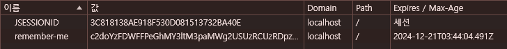
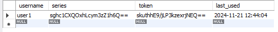
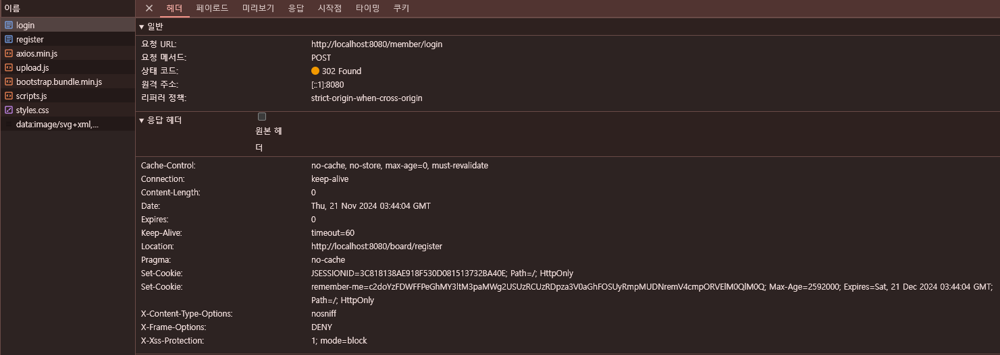

# 8.1 스프링 시큐리티 적용하기 678

[build.gradle](../../build.gradle)
\+ 
```groovy
implementation 'org.springframework.boot:spring-boot-starter-security'
```

```shell
Using generated security password: cf5d9557-5646-475e-982a-c04410bc52ea

This generated password is for development use only. Your security configuration must be updated before running your application in production.
```
그래들에 security 추가하면
로그에 위와 같은 security password 로그가 나오고
기존에 아무 문제없이 접근할 수 있는 '/board/list'에 로그인 처리가 필요해짐

```shell
2024-11-21 11:01:12.675  INFO 6160 --- [  restartedMain] o.z.b01.config.CustomSecurityConfig      : config
```

filterChain메소드가 동작하면 이전과 달리 '/board/list'에 바로 접근가능

## 로그레벨조정
[application.properties](../../src/main/resources/application.properties)
```
logging.level.org.springframework.security=trace
```

```shell
2024-11-21 11:09:37.054 TRACE 16676 --- [nio-8080-exec-3] o.s.security.web.FilterChainProxy        : Trying to match request against DefaultSecurityFilterChain [RequestMatcher=any request, Filters=[org.springframework.security.web.session.DisableEncodeUrlFilter@625fc6c7, org.springframework.security.web.context.request.async.WebAsyncManagerIntegrationFilter@495aeb1e, org.springframework.security.web.context.SecurityContextPersistenceFilter@85760f0, org.springframework.security.web.header.HeaderWriterFilter@2aa0a79a, org.springframework.security.web.csrf.CsrfFilter@140479f5, org.springframework.security.web.authentication.logout.LogoutFilter@28460fd5, org.springframework.security.web.savedrequest.RequestCacheAwareFilter@7035ca81, org.springframework.security.web.servletapi.SecurityContextHolderAwareRequestFilter@72804935, org.springframework.security.web.authentication.AnonymousAuthenticationFilter@201da80b, org.springframework.security.web.session.SessionManagementFilter@6044342e, org.springframework.security.web.access.ExceptionTranslationFilter@30aa4520]] (1/1)
2024-11-21 11:09:37.054 DEBUG 16676 --- [nio-8080-exec-3] o.s.security.web.FilterChainProxy        : Securing GET /board/list?page=1&size=10
2024-11-21 11:09:37.054 TRACE 16676 --- [nio-8080-exec-3] o.s.security.web.FilterChainProxy        : Invoking DisableEncodeUrlFilter (1/11)
2024-11-21 11:09:37.054 TRACE 16676 --- [nio-8080-exec-3] o.s.security.web.FilterChainProxy        : Invoking WebAsyncManagerIntegrationFilter (2/11)
2024-11-21 11:09:37.054 TRACE 16676 --- [nio-8080-exec-3] o.s.security.web.FilterChainProxy        : Invoking SecurityContextPersistenceFilter (3/11)
2024-11-21 11:09:37.054 TRACE 16676 --- [nio-8080-exec-3] w.c.HttpSessionSecurityContextRepository : No HttpSession currently exists
2024-11-21 11:09:37.054 TRACE 16676 --- [nio-8080-exec-3] w.c.HttpSessionSecurityContextRepository : Created SecurityContextImpl [Null authentication]
2024-11-21 11:09:37.054 DEBUG 16676 --- [nio-8080-exec-3] s.s.w.c.SecurityContextPersistenceFilter : Set SecurityContextHolder to empty SecurityContext
2024-11-21 11:09:37.054 TRACE 16676 --- [nio-8080-exec-3] o.s.security.web.FilterChainProxy        : Invoking HeaderWriterFilter (4/11)
2024-11-21 11:09:37.054 TRACE 16676 --- [nio-8080-exec-3] o.s.security.web.FilterChainProxy        : Invoking CsrfFilter (5/11)
2024-11-21 11:09:37.054 TRACE 16676 --- [nio-8080-exec-3] o.s.security.web.csrf.CsrfFilter         : Did not protect against CSRF since request did not match CsrfNotRequired [TRACE, HEAD, GET, OPTIONS]
2024-11-21 11:09:37.054 TRACE 16676 --- [nio-8080-exec-3] o.s.security.web.FilterChainProxy        : Invoking LogoutFilter (6/11)
2024-11-21 11:09:37.054 TRACE 16676 --- [nio-8080-exec-3] o.s.s.w.a.logout.LogoutFilter            : Did not match request to Ant [pattern='/logout', POST]
2024-11-21 11:09:37.054 TRACE 16676 --- [nio-8080-exec-3] o.s.security.web.FilterChainProxy        : Invoking RequestCacheAwareFilter (7/11)
2024-11-21 11:09:37.055 TRACE 16676 --- [nio-8080-exec-3] o.s.s.w.s.HttpSessionRequestCache        : No saved request
2024-11-21 11:09:37.055 TRACE 16676 --- [nio-8080-exec-3] o.s.security.web.FilterChainProxy        : Invoking SecurityContextHolderAwareRequestFilter (8/11)
2024-11-21 11:09:37.055 TRACE 16676 --- [nio-8080-exec-3] o.s.security.web.FilterChainProxy        : Invoking AnonymousAuthenticationFilter (9/11)
2024-11-21 11:09:37.055 TRACE 16676 --- [nio-8080-exec-3] o.s.s.w.a.AnonymousAuthenticationFilter  : Set SecurityContextHolder to AnonymousAuthenticationToken [Principal=anonymousUser, Credentials=[PROTECTED], Authenticated=true, Details=WebAuthenticationDetails [RemoteIpAddress=0:0:0:0:0:0:0:1, SessionId=null], Granted Authorities=[ROLE_ANONYMOUS]]
2024-11-21 11:09:37.055 TRACE 16676 --- [nio-8080-exec-3] o.s.security.web.FilterChainProxy        : Invoking SessionManagementFilter (10/11)
2024-11-21 11:09:37.055 DEBUG 16676 --- [nio-8080-exec-3] o.s.s.w.session.SessionManagementFilter  : Request requested invalid session id 8412A25F13790F8EBA344134E7E8F20C
2024-11-21 11:09:37.055 TRACE 16676 --- [nio-8080-exec-3] o.s.security.web.FilterChainProxy        : Invoking ExceptionTranslationFilter (11/11)
2024-11-21 11:09:37.055 DEBUG 16676 --- [nio-8080-exec-3] o.s.security.web.FilterChainProxy        : Secured GET /board/list?page=1&size=10
```
10개 이상 위에선 11개의 필터가 작용

#### 정적 자원의 처리 682
로그를 보면 css, js 파일에도 필터가 적용되고 있는것 확인
정적 파일에 시큐리티를 적용할 필요가 없으므로 webSecurityCustomizer() 메소드 설정을 추가
- [CustomSecurityConfig.java](../../src/main/java/org/zerock/b01/config/CustomSecurityConfig.java)
```java
    @Bean
    public WebSecurityCustomizer webSecurityCustomizer() {
        log.info("web config");
        return (web) -> web.ignoring().requestMatchers(PathRequest.toStaticResources().atCommonLocations());
    }
```
http://localhost:8080/css/styles.css
```shell
2024-11-21 11:40:34.638 TRACE 16676 --- [nio-8080-exec-7] o.s.security.web.FilterChainProxy        : Trying to match request against DefaultSecurityFilterChain [RequestMatcher=org.springframework.boot.autoconfigure.security.servlet.StaticResourceRequest$StaticResourceRequestMatcher@30145bb, Filters=[]] (1/2)
2024-11-21 11:40:34.638 TRACE 16676 --- [nio-8080-exec-7] o.s.security.web.FilterChainProxy        : No security for GET /css/styles.css
```

### 인증과 인가/권한 683
- 인증 Authentication: 스스로를 증명하다. 로그인. 인증을 위해서 사용자는 자신이 알고 있느느 자신의 정보를 제공하는데 아이디와 패스워드가 이에 속함
- 인가 Authorization: 허가나 권한이라는 개념과 같음. 인증이 된 사용자라 해도 이에 접근할수 있는 권한이 있는지를 확인하는 과정을 의미


http://localhost:8080/login

Username: user1
```shell
2024-11-21 11:47:14.422  INFO 16676 --- [nio-8080-exec-4] o.z.b.security.CustomUserDetailsService  : loadUserByUsername:user1
```

```shell
2024-11-21 11:54:06.105 DEBUG 16676 --- [nio-8080-exec-1] w.c.HttpSessionSecurityContextRepository : 
Stored SecurityContextImpl [Authentication=UsernamePasswordAuthenticationToken 
[Principal=org.springframework.security.core.userdetails.User 
[Username=user1, Password=[PROTECTED], Enabled=true, AccountNonExpired=true, credentialsNonExpired=true, AccountNonLocked=true, 
Granted Authorities=[ROLE_USER]], 
Credentials=[PROTECTED], Authenticated=true, 
Details=WebAuthenticationDetails 
[RemoteIpAddress=0:0:0:0:0:0:0:1, SessionId=885CD617F499CCDCEF88E36A1DD5EA30], 
Granted Authorities=[ROLE_USER]]] 
to HttpSession [org.apache.catalina.session.StandardSessionFacade@23c8cb9c]
```

### remember-me 기능 설정 702
```sql
create table persistent_logins (
	username varchar(64) not null,
	series varchar(64) primary key,
	token varchar(64) not null,
	last_used timestamp not null
);
```
[CustomSecurityConfig.java](../../src/main/java/org/zerock/b01/config/CustomSecurityConfig.java)

30일 유효기간
60*60*24*30
11-21~ 12-21




Set Cookie: remember-me=c2doYzFDWFFPeGhMY3ltM3paMWg2USUzRCUzRDpza3V0aGhFOSUyRmpMUDNremV4cmpORVElM0QlM0Q; Max-Age=2592000; Expires=Sat, 21 Dec 2024 03:44:04 GMT; Path=/; HttpOnly

# 화면에서 인증 처리하기와 컨트롤러 707
```groovy
implementation 'org.thymeleaf.extras:thymeleaf-extras-springsecurity5'
```

```javascript
const auth = {"authorities":[{"authority":"ROLE_USER"}],
    "details":{"remoteAddress":"0:0:0:0:0:0:0:1","sessionId":null},
    "authenticated":true,
    "principal":{
        "password":null,
        "username":"user1",
        "authorities":[{"authority":"ROLE_USER"}],
        "accountNonExpired":true,"accountNonLocked":true,"credentialsNonExpired":true,"enabled":true},
    "keyHash":-1861353340,"credentials":"",
    "name":"user1"};
```

#### 게시물 수정 처리 714
현재 로그인한 사용자와 게시물 작성자 정보가 일치할때만 수정/삭제
[BoardController.java](../../src/main/java/org/zerock/b01/controller/BoardController.java)
user1이 작성한 글을 user2가 수정페이지 url를 직접 이동해서 폼을 post로 넘길때
수정페이지는 들어가짐..
http://localhost:8080/board/modify?bno=1

```
Whitelabel Error Page
This application has no explicit mapping for /error, so you are seeing this as a fallback.

Thu Nov 21 14:47:17 KST 2024
There was an unexpected error (type=Forbidden, status=403).
Forbidden
org.springframework.security.access.AccessDeniedException: 접근이 거부되었습니다.
```

http://localhost:8080/member/login?error=ACCESS_DENIED

#### 게시물의 삭제 처리 718
[BoardController.java](../../src/main/java/org/zerock/b01/controller/BoardController.java)