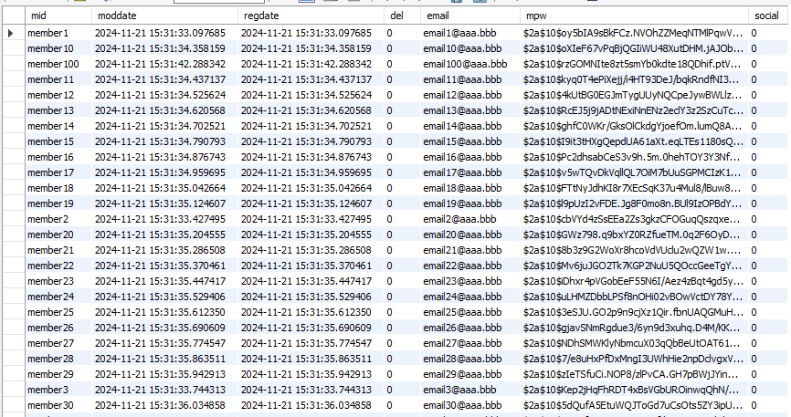
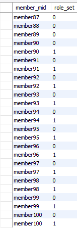

# 8.2 회원 데이터 처리 720
## 회원 도메인과 Repository
```shell
Hibernate: 
    select
        member0_.mid as mid1_2_0_,
        member0_.moddate as moddate2_2_0_,
        member0_.regdate as regdate3_2_0_,
        member0_.del as del4_2_0_,
        member0_.email as email5_2_0_,
        member0_.mpw as mpw6_2_0_,
        member0_.social as social7_2_0_ 
    from
        member member0_ 
    where
        member0_.mid=?
Hibernate: 
    insert 
    into
        member
        (moddate, regdate, del, email, mpw, social, mid) 
    values
        (?, ?, ?, ?, ?, ?, ?)
Hibernate: 
    insert 
    into
        member_role_set
        (member_mid, role_set) 
    values
        (?, ?)
```



- member_role_sets 테이블


```shell
org.springframework.dao.InvalidDataAccessApiUsageException:
 For queries with named parameters you need to provide names for method parameters; 
 Use @Param for query method parameters, or when on Java 8+ use the javac flag -parameters; 
 nested exception is java.lang.IllegalStateException: 
 For queries with named parameters you need to provide names for method parameters; 
 Use @Param for query method parameters, or when on Java 8+ use the javac flag -parameters
```
@Param 추가
```java
Optional<Member> getWithRoles(@Param("mid") String mid);
```
참고:https://velog.io/@offsujin/JPA-InvalidDataAccessApiUsageException-%EC%98%A4%EB%A5%98-%ED%95%B4%EA%B2%B0


```shell
Hibernate: 
    select
        member0_.mid as mid1_2_,
        member0_.moddate as moddate2_2_,
        member0_.regdate as regdate3_2_,
        member0_.del as del4_2_,
        member0_.email as email5_2_,
        member0_.mpw as mpw6_2_,
        member0_.social as social7_2_,
        roleset1_.member_mid as member_m1_3_0__,
        roleset1_.role_set as role_set2_3_0__ 
    from
        member member0_ 
    left outer join
        member_role_set roleset1_ 
            on member0_.mid=roleset1_.member_mid 
    where
        member0_.mid=? 
        and member0_.social=0
2024-11-21 15:41:44.838  INFO 10480 --- [           main] o.z.b.repository.MemberRepositoryTests   : Member(mid=member100, mpw=$2a$10$rzGOMNIte8zt5smYb0kdte18QDhif.ptV.pTD.NF.zXjicQvrpXqi, email=email100@aaa.bbb, del=false, social=false)
2024-11-21 15:41:44.839  INFO 10480 --- [           main] o.z.b.repository.MemberRepositoryTests   : [ADMIN, USER]
2024-11-21 15:41:44.839  INFO 10480 --- [           main] o.z.b.repository.MemberRepositoryTests   : ADMIN
2024-11-21 15:41:44.840  INFO 10480 --- [           main] o.z.b.repository.MemberRepositoryTests   : USER
```


