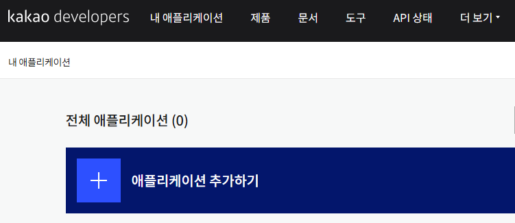
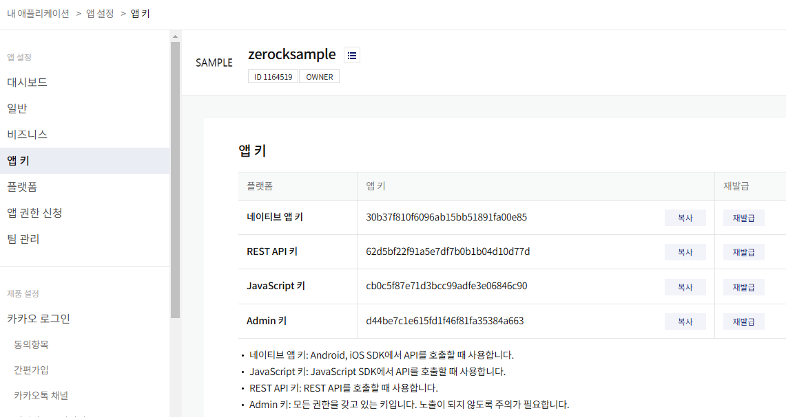
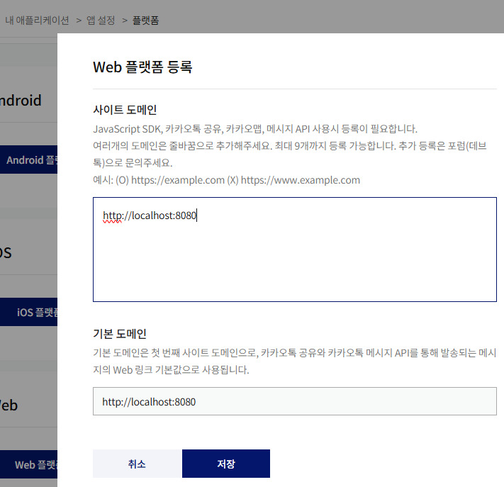
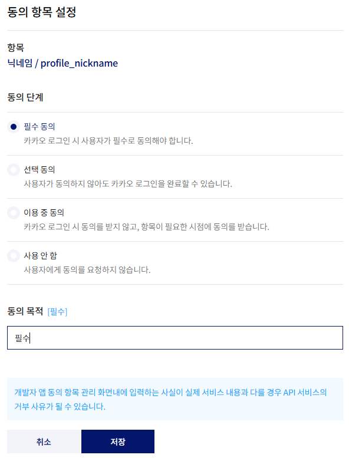
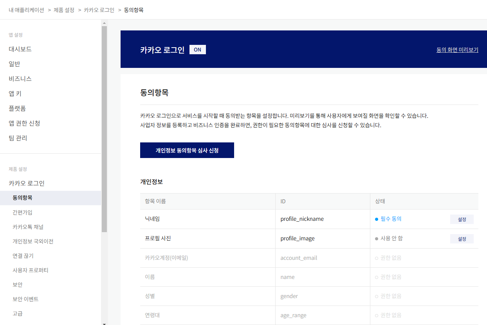
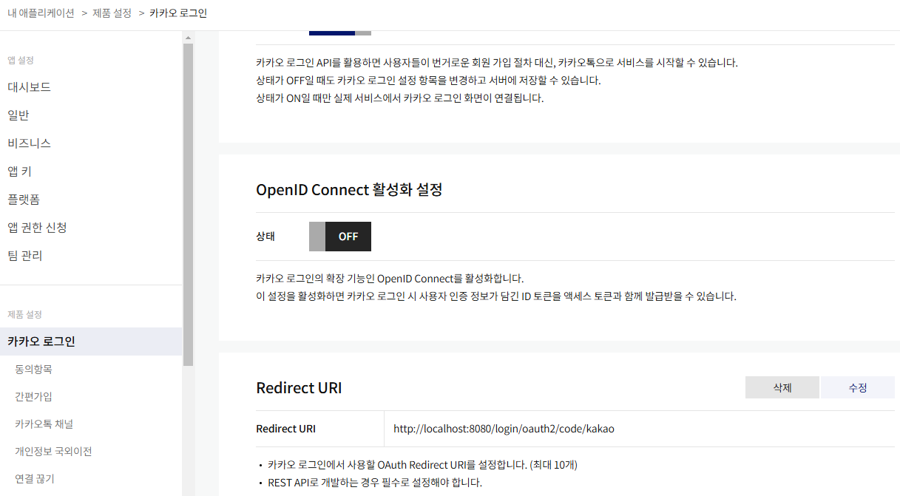
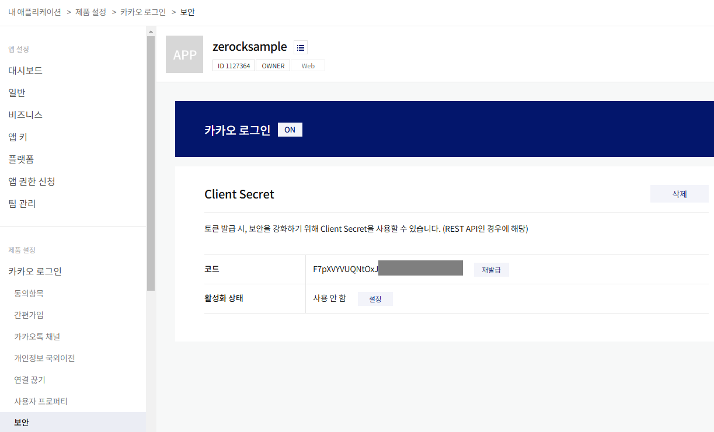
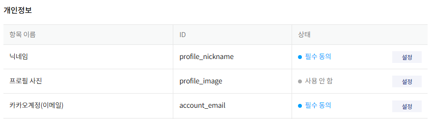

# 8.3 소셜 로그인 739
## 프로젝트를 위한 설정
### 카카오 로그인 설정
https://developers.kakao.com/

#### 애플리케이션 추가하기
- 내 애플리케이션


- 애플리케이션 추가하기
- 앱 키
내 애플리케이션>앱 설정>앱 키


11. 활성화 설정 ON
12. Redirect URI 지정
    - 카카오 로그인 - Redirect URI: http://localhost:8080/login/oauth2/code/kakao


내 애플리케이션>앱 설정>플랫폼

내 애플리케이션>제품 설정>카카오 로그인>동의항목


개인 비즈니스 전환후
- 내 애플리케이션>제품 설정>카카오 로그인:Redirect URI

- 내 애플리케이션>제품 설정>카카오 로그인>보안


### 프로젝트를 위한 설정 742
```groovy
implementation 'org.springframework.boot:spring-boot-starter-oauth2-client'
```

### 소셜 로그인이 처리되는 과정 OAuth2 743
OAuth2(https://oauth.net/2/)
토큰을 주고받는 방식으로 토큰을 발행하거나 검사하는 방식을 통해서 서비스 간 데이터를 교환

Rest API https://developers.kakao.com/docs/latest/ko/rest-api/getting-started
카카오 로그인 https://developers.kakao.com/docs/latest/ko/kakaologin/common

### 스프링 부트에서 로그인 연동 설정 745
`spring.security.oauth2.client.registration.kakao.client-id=`앱키:RestAPI키

`spring.security.oauth2.client.registration.kakao.client-secret=`보안:Client Secret 코드

`spring.security.oauth2.client.registration.kakao.scope=profile_nickname`
동의항목 ID
닉네임 profile_nickname 필수동의
카카오계정(이메일) account_email 권한없음

#### CustomSecurityConfig 설정 변경 746
[CustomSecurityConfig.java](../../src/main/java/org/zerock/b01/config/CustomSecurityConfig.java)


### 로그인 연동 후 이메일 구하기 748
[CustomOAuth2UserService.java](../../src/main/java/org/zerock/b01/security/CustomOAuth2UserService.java)
```shell
2024-11-22 12:10:58.031  INFO 1160 --- [nio-8080-exec-1] o.z.b.security.CustomOAuth2UserService   : userRequest...
2024-11-22 12:10:58.031  INFO 1160 --- [nio-8080-exec-1] o.z.b.security.CustomOAuth2UserService   : org.springframework.security.oauth2.client.userinfo.OAuth2UserRequest@4c398a06
```

```shell
2024-11-22 12:14:14.335  INFO 15088 --- [nio-8080-exec-9] o.z.b.security.CustomOAuth2UserService   : kakao
2024-11-22 12:14:14.392  INFO 15088 --- [nio-8080-exec-9] o.z.b.security.CustomOAuth2UserService   : ---------------------
2024-11-22 12:14:14.395  INFO 15088 --- [nio-8080-exec-9] o.z.b.security.CustomOAuth2UserService   : id:1234567890
2024-11-22 12:14:14.395  INFO 15088 --- [nio-8080-exec-9] o.z.b.security.CustomOAuth2UserService   : ---------------------
2024-11-22 12:14:14.395  INFO 15088 --- [nio-8080-exec-9] o.z.b.security.CustomOAuth2UserService   : connected_at:2024-11-22T03:06:23Z
2024-11-22 12:14:14.395  INFO 15088 --- [nio-8080-exec-9] o.z.b.security.CustomOAuth2UserService   : ---------------------
2024-11-22 12:14:14.395  INFO 15088 --- [nio-8080-exec-9] o.z.b.security.CustomOAuth2UserService   : properties:{nickname=💜}
2024-11-22 12:14:14.395  INFO 15088 --- [nio-8080-exec-9] o.z.b.security.CustomOAuth2UserService   : ---------------------
2024-11-22 12:14:14.395  INFO 15088 --- [nio-8080-exec-9] o.z.b.security.CustomOAuth2UserService   : 
kakao_account:{profile_nickname_needs_agreement=false, profile={nickname=💜, is_default_nickname=false}}
```

- clientName: kakao

비즈니스
개인 개발자 비즈 앱 신청>2단계인증설정>



Map<String, Object> OAuth2User.getAttributes();
```
{
    id=3802749498, 
    connected_at=2024-11-22T03:06:23Z, 
    properties={nickname=💜}, 
    kakao_account={
        profile_nickname_needs_agreement=false, 
        profile={nickname=💜, is_default_nickname=false}, 
        has_email=true, 
        email_needs_agreement=true
    }
}
```
id=380302765
```
{
    profile_nickname_needs_agreement=false, 
    profile={nickname=💜, is_default_nickname=false}, 
    has_email=true, 
    email_needs_agreement=false, 
    is_email_valid=true, 
    is_email_verified=true, 
    email=purplike@kakao.com
}
```